# Hikma Backend Architecture Documentation

## System Overview

Hikma is an **Agentic Code Intelligence Platform** built with a modern microservice architecture using **Fastify + TypeScript**. The system provides intelligent code assistance through advanced RAG (Retrieval-Augmented Generation) capabilities, combining vector search, LLM integration, and multi-source data ingestion.

### Core Value Proposition
- **Intelligent Code Understanding**: Semantic analysis of codebases using vector embeddings
- **Context-Aware Responses**: Multi-turn conversations with project context
- **Multi-Source Integration**: Git, GitHub, Jira, and other development tools
- **Production-Ready**: Scalable, secure, and observable architecture

---

## High-Level Architecture

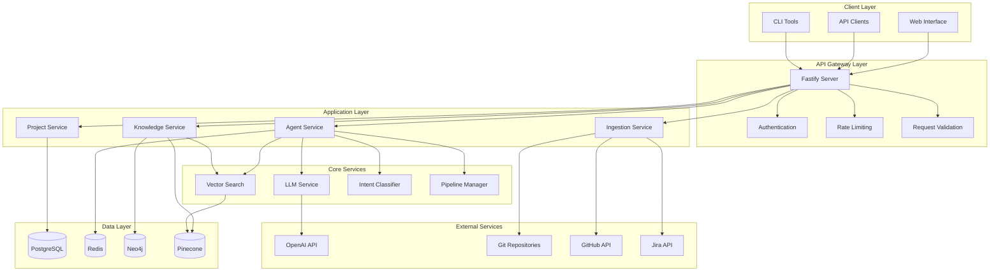

---

## Detailed Component Architecture

### 1. API Gateway Layer

#### Fastify Server (`src/server.ts`)
**Purpose**: Main HTTP server and request routing  
**Responsibilities**:
- HTTP request handling and routing
- Middleware orchestration
- CORS and security headers
- Graceful shutdown handling
- Health check endpoints

**Key Features**:
- Production-ready configuration
- Comprehensive middleware stack
- Environment-specific settings
- Request correlation tracking

#### Authentication Middleware (`src/modules/interfaces/api/middleware/auth.ts`)
**Purpose**: JWT-based authentication and authorization  
**Responsibilities**:
- JWT token validation
- User context extraction
- Role-based access control
- API key authentication

**Security Features**:
- Secure token verification
- User session management
- Rate limiting integration
- Audit logging

#### Request Validation (`src/modules/interfaces/api/middleware/validation.ts`)
**Purpose**: Input validation and sanitization  
**Responsibilities**:
- Zod schema validation
- Request body/query/params validation
- Error formatting
- Type safety enforcement

---

### 2. Application Services Layer

#### Agent Service (`src/modules/agents/services/agent-service.ts`)
**Purpose**: Main orchestrator for AI agent functionality  
**Responsibilities**:
- Query processing coordination
- Intent classification
- Pipeline execution
- Response generation
- Conversation management

**Architecture Pattern**: Orchestrator pattern with event-driven communication

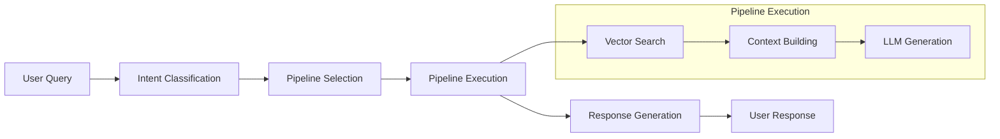

#### Knowledge Service (`src/modules/knowledge/services/`)
**Purpose**: Knowledge base management and search  
**Responsibilities**:
- Document processing and chunking
- Embedding generation
- Vector storage and retrieval
- Semantic search
- Knowledge graph management

**Components**:
- **Embedding Service**: OpenAI embedding generation
- **Vector Store**: Pinecone integration
- **Document Processor**: Multi-strategy chunking
- **Vector Search**: Semantic and hybrid search

#### Project Service (`src/modules/interfaces/api/routes/project.ts`)
**Purpose**: Project lifecycle management  
**Responsibilities**:
- Project CRUD operations
- Repository configuration
- Sync job management
- Access control
- Project analytics

---

### 3. Core Intelligence Layer

#### Intent Classification Service (`src/modules/agents/services/intent-classifier.ts`)
**Purpose**: Understanding user query intent  
**Approach**: Hybrid rule-based + LLM classification

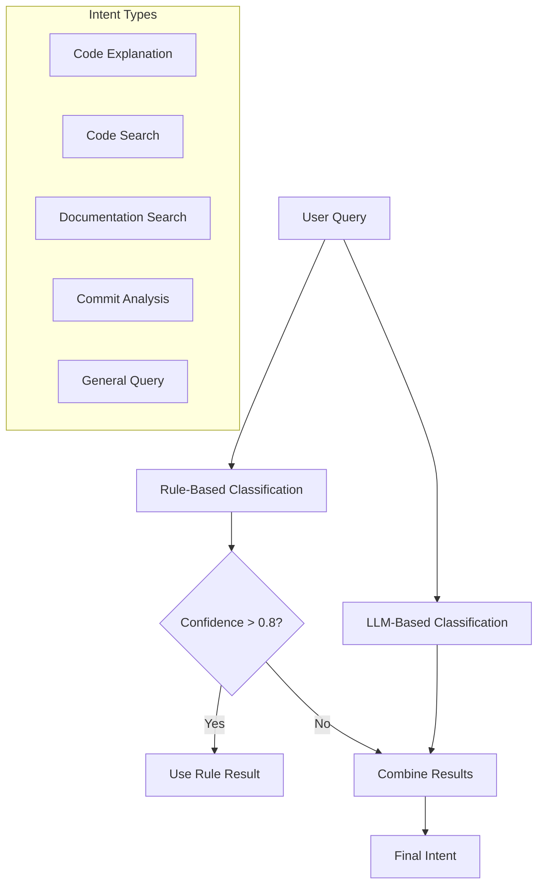

**Intent Categories**:
- **Code Explanation**: Understanding how code works
- **Code Search**: Finding specific implementations
- **Documentation Search**: Locating guides and docs
- **Commit Analysis**: Understanding code changes
- **General Query**: Open-ended questions

#### Pipeline Manager (`src/modules/agents/services/pipeline-manager.ts`)
**Purpose**: Multi-step workflow execution  
**Architecture**: Pipeline pattern with configurable steps

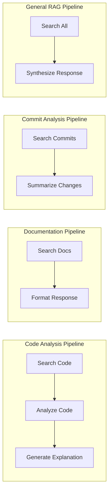

**Pipeline Types**:
- **Search and Answer**: General RAG workflow
- **Code Analysis**: Code-specific analysis
- **Documentation Lookup**: Documentation retrieval
- **Commit Summary**: Change analysis

#### LLM Service (`src/modules/agents/services/llm-service.ts`)
**Purpose**: OpenAI integration and prompt management  
**Capabilities**:
- Chat completion with streaming
- Function calling support
- Token management and estimation
- Multiple model support
- Rate limiting and error handling

---

### 4. Data Ingestion Layer

#### Base Connector (`src/modules/ingestion/connectors/base-connector.ts`)
**Purpose**: Common connector framework  
**Pattern**: Template method pattern with event-driven architecture

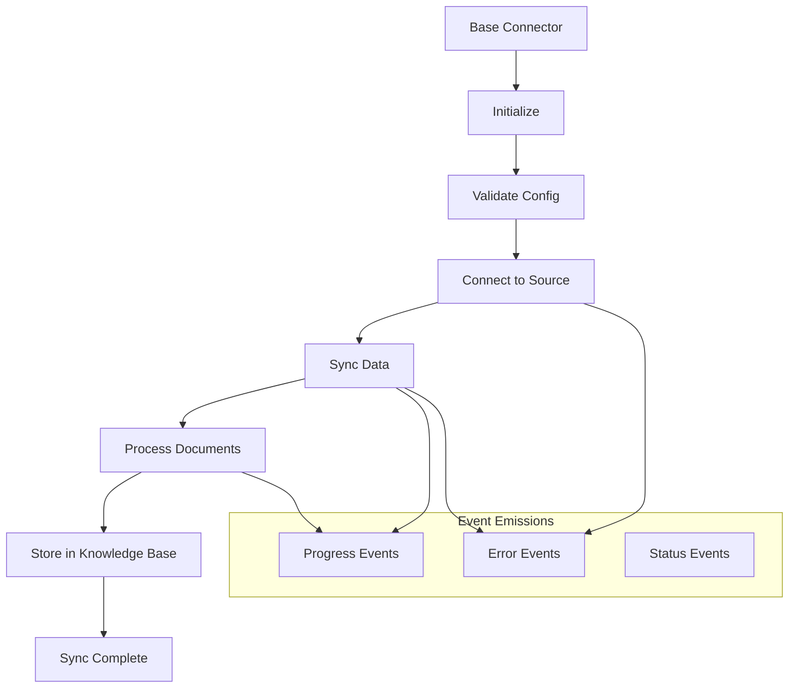

#### Git Connector (`src/modules/ingestion/connectors/git-connector.ts`)
**Purpose**: Git repository analysis and ingestion  
**Capabilities**:
- File content extraction
- Commit history analysis
- Language detection
- Incremental sync support
- Smart filtering

**Processing Flow**:
1. Repository validation
2. File discovery and filtering
3. Content extraction and processing
4. Commit history analysis
5. Metadata enrichment
6. Knowledge base storage

---

### 5. Data Storage Layer

#### PostgreSQL (Primary Database)
**Purpose**: Relational data storage  
**Schema**: Comprehensive data model with 20+ entities

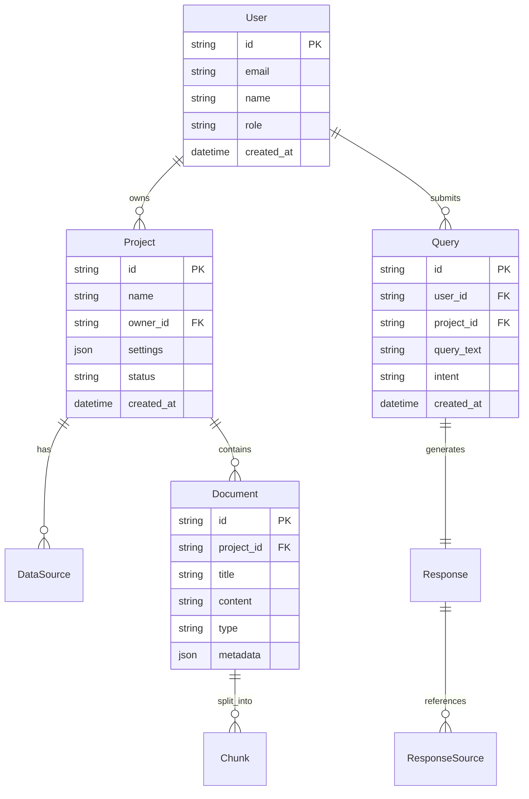

#### Redis (Caching & Sessions)
**Purpose**: High-performance caching and session storage  
**Use Cases**:
- Authentication token caching
- Rate limiting counters
- Temporary data storage
- Pub/sub messaging

#### Neo4j (Graph Database)
**Purpose**: Relationship and graph data  
**Use Cases**:
- Code dependency graphs
- Knowledge relationships
- User interaction patterns
- Project relationships

#### Pinecone (Vector Database)
**Purpose**: Vector embeddings and semantic search  
**Configuration**:
- Dimensions: 1536 (OpenAI ada-002)
- Metric: Cosine similarity
- Namespace-based multi-tenancy

---

## Data Flow Architecture

### Query Processing Flow

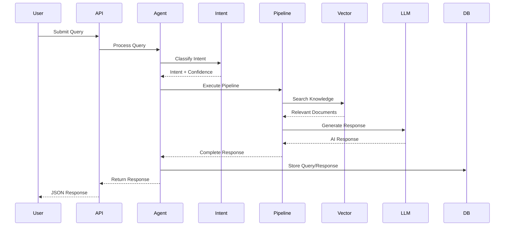

### Data Ingestion Flow

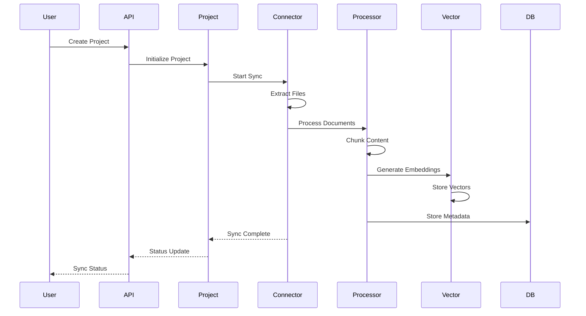

---

## Security Architecture

### Authentication & Authorization

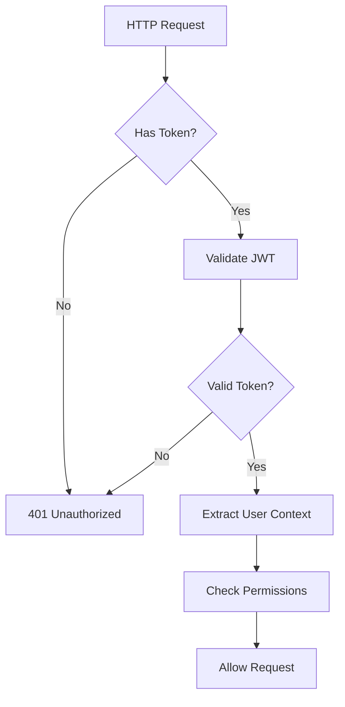

**Security Layers**:
1. **Transport Security**: HTTPS enforcement
2. **Authentication**: JWT token validation
3. **Authorization**: Role-based access control
4. **Input Validation**: Request sanitization
5. **Rate Limiting**: Abuse prevention
6. **Audit Logging**: Security event tracking

### Data Protection
- **Encryption at Rest**: Database encryption
- **Encryption in Transit**: TLS/HTTPS
- **Token Security**: Secure JWT handling
- **Input Sanitization**: XSS/injection prevention
- **CORS Configuration**: Cross-origin protection

---

## Scalability & Performance

### Horizontal Scaling Strategy

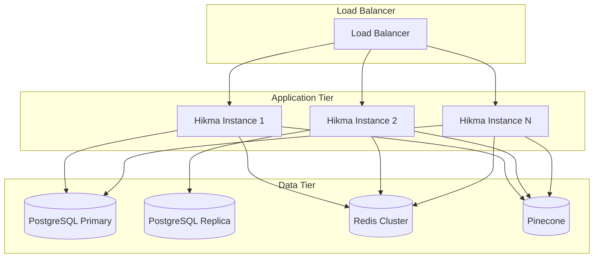

### Performance Optimizations
- **Connection Pooling**: Database connection management
- **Caching Strategy**: Multi-layer caching
- **Batch Processing**: Efficient bulk operations
- **Async Processing**: Non-blocking operations
- **Rate Limiting**: Resource protection
- **Query Optimization**: Efficient database queries

---

## Observability & Monitoring

### Logging Architecture

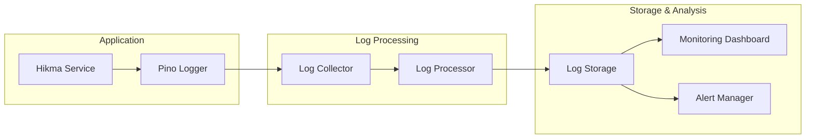

**Logging Features**:
- **Structured Logging**: JSON format with correlation IDs
- **Log Levels**: Debug, info, warn, error, fatal
- **Context Enrichment**: Request context and user information
- **Performance Tracking**: Execution time and resource usage
- **Error Tracking**: Detailed error information and stack traces

### Health Monitoring
- **Service Health**: Individual service status
- **Dependency Health**: External service monitoring
- **Performance Metrics**: Response times and throughput
- **Resource Monitoring**: CPU, memory, and disk usage
- **Business Metrics**: Query success rates and user activity

---

## Deployment Architecture

### Container Strategy

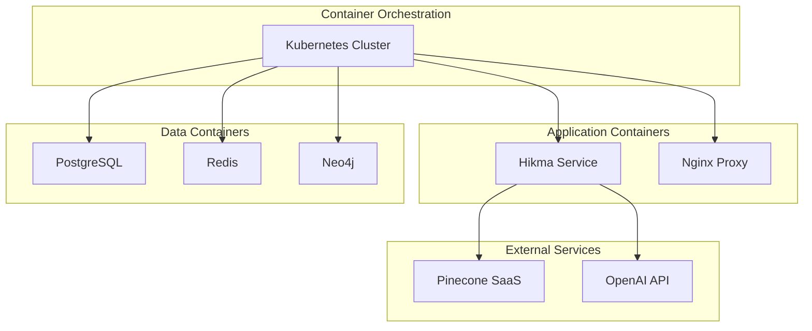

### Environment Configuration
- **Development**: Local Docker Compose
- **Staging**: Kubernetes with reduced resources
- **Production**: Kubernetes with high availability
- **Testing**: Isolated test environments

---

## API Design Principles

### RESTful Design
- **Resource-Based URLs**: Clear resource identification
- **HTTP Methods**: Proper verb usage (GET, POST, PUT, DELETE)
- **Status Codes**: Meaningful HTTP status codes
- **Content Negotiation**: JSON API responses
- **Versioning**: API version management

### Error Handling
```typescript
interface ErrorResponse {
  success: false;
  error: string;
  message: string;
  correlationId: string;
  details?: any;
}
```

### Response Format
```typescript
interface SuccessResponse<T> {
  success: true;
  data: T;
  metadata?: any;
  correlationId: string;
}
```

---

## Technology Stack Summary

### Core Technologies
- **Runtime**: Node.js 20+
- **Framework**: Fastify 4+
- **Language**: TypeScript 5+
- **Database ORM**: Prisma
- **Validation**: Zod
- **Logging**: Pino

### External Services
- **Vector Database**: Pinecone
- **LLM Provider**: OpenAI
- **Primary Database**: PostgreSQL
- **Cache/Session**: Redis
- **Graph Database**: Neo4j

### Development Tools
- **Build Tool**: TypeScript Compiler
- **Linting**: ESLint
- **Formatting**: Prettier
- **Testing**: Jest (planned)
- **Containerization**: Docker

---

## Future Architecture Considerations

### Microservices Evolution
- **Service Decomposition**: Split into focused microservices
- **Event-Driven Architecture**: Async communication patterns
- **API Gateway**: Centralized routing and cross-cutting concerns
- **Service Mesh**: Advanced networking and observability

### Advanced Features
- **Real-time Processing**: WebSocket integration
- **Stream Processing**: Event streaming with Kafka
- **Machine Learning**: Custom model training and deployment
- **Multi-tenancy**: Enhanced isolation and resource management

This architecture provides a solid foundation for a production-ready agentic code intelligence platform with room for future growth and enhancement.

