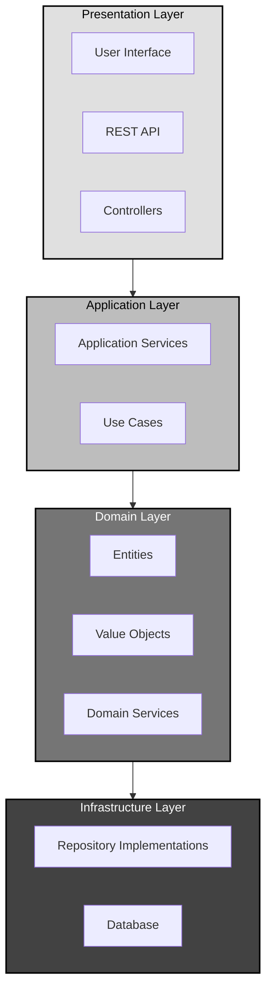
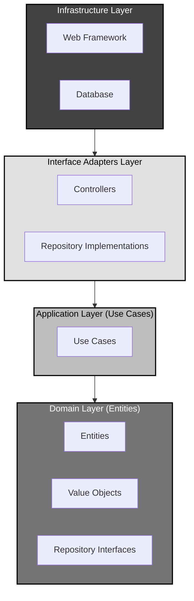
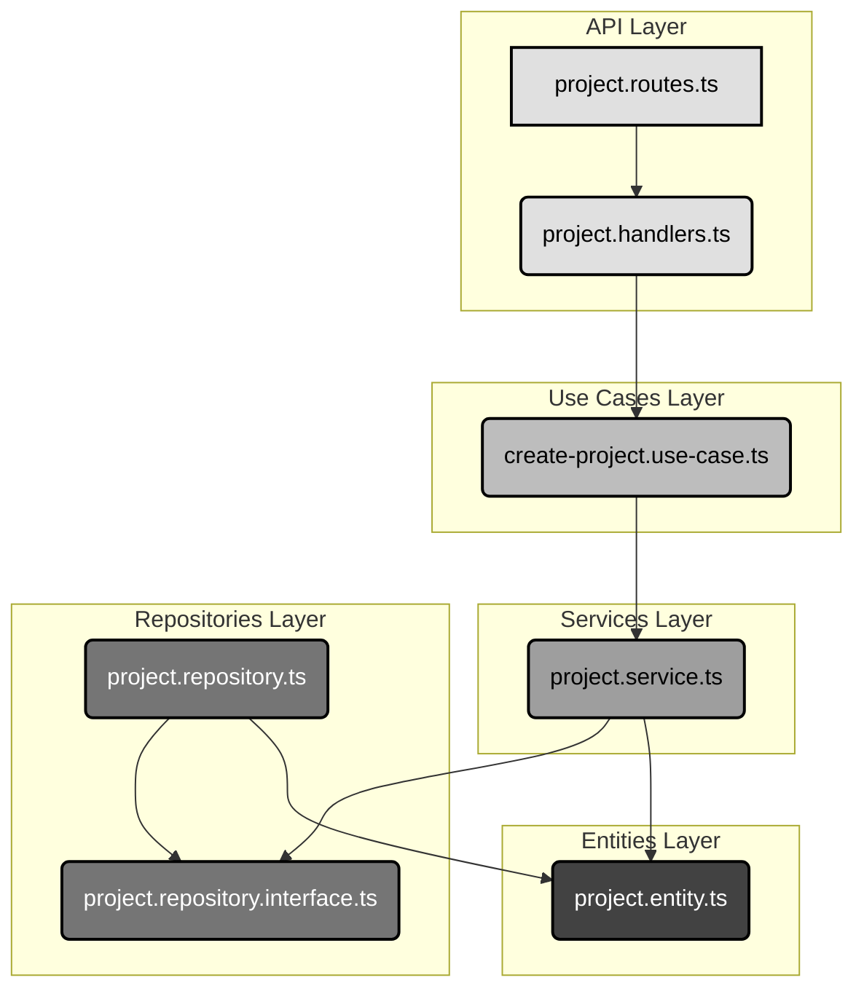

# The Blueprint and the Building: A Pragmatic Guide to Our Architecture

## 1. The Philosophy: Blueprint vs. Building

In software development, "architecture" can feel abstract. We chase ideals like "Clean Architecture," "Hexagonal," or "DDD," often getting lost in theoretical debates. But what truly defines a robust system? Is it the rigid folder structure, or something deeper?

The answer lies in a crucial distinction: the difference between the **logical code flow** (the blueprint) and the **physical file location** (the building).

*   **The Blueprint (Logical Flow):** This is the architect's design. It dictates how a request travels from the UI to the database, which components can talk to each other, and which parts are independent. This is what grants us maintainability, testability, and flexibility.
*   **The Building (File Location):** This is the construction site. We group files by feature (`/products`) or by layer (`/controllers`, `/services`) for convenience and discoverability. This is a pragmatic choice.

A great architecture is not about a "perfect" folder structure. It's about a robust, dependency-correct **logical flow**.

But how do we ensure our blueprint remains sound? The answer lies in understanding the fundamental rules that govern architectural relationships.

## 2. The Foundation: Why Direction Matters

All software architectures, regardless of their names or patterns, are fundamentally about **relationships between components**. Every component in your system has relationships with others—some components use others, some provide services, some coordinate between layers.

Here's the crucial insight: **every relationship has a direction**. When Component A uses Component B, that creates a directional relationship from A to B. This direction matters because:

*   **It determines coupling:** The direction shows which components are coupled to which others
*   **It affects testability:** Components that depend on many others are harder to test in isolation
*   **It impacts flexibility:** The direction determines which components can change independently
*   **It defines boundaries:** Clear directional rules create natural boundaries between different parts of your system

In code, these relationships manifest as dependencies between components. Understanding how to control and organize these dependencies is the key to architectural success.

## 3. Translating Relationships into Code: Dependency Direction

Now that we understand architecture is about relationships, let's see how these relationships translate into actual code. "Direction" in an architecture diagram is nothing more than the direction of your `import`/`require` statements (or, in compiled languages, the direction of project/assembly references).

When an arrow on the diagram goes from **A to B**, it literally means:


*   Code living in **A** is allowed to `import { something } from 'B'`.
*   Code living in **B** is **not** allowed to `import { anything } from 'A'`.

If you violate that rule, you have "inverted the dependency direction".

### Practical Examples

**Good Dependency Direction:**
```typescript
// In /controllers/user.controller.ts (Outer Layer)
import { UserService } from '../services/user.service'; // ✅ Controller depends on Service

// In /services/user.service.ts (Middle Layer)
import { User } from '../entities/user.entity'; // ✅ Service depends on Entity
import { UserRepository } from '../repositories/user.repository.interface'; // ✅ Service depends on Repository Interface

// In /repositories/user.repository.ts (Infrastructure)
import { UserRepository } from './user.repository.interface'; // ✅ Implementation depends on Interface
```

**Bad Dependency Direction:**
```typescript
// In /entities/user.entity.ts (Inner Layer)
import { UserService } from '../services/user.service'; // ❌ Entity should not depend on Service

// In /services/user.service.ts (Middle Layer)
import { UserController } from '../controllers/user.controller'; // ❌ Service should not depend on Controller

// In /repositories/user.repository.interface.ts (Domain)
import { DatabaseConnection } from '../infrastructure/database'; // ❌ Interface should not depend on Infrastructure
```

Understanding dependency direction allows us to evaluate different architectural approaches and choose patterns that create the most maintainable systems.

## 4. Architectural Patterns: Organizing Dependencies for Success

Armed with our understanding of dependency direction, let's examine how different architectural patterns organize these relationships. Each pattern represents a different strategy for managing dependencies to achieve specific goals like maintainability, testability, and flexibility.

### 4.1. Traditional Layered Architecture: The Straightforward Approach

This model organizes code into horizontal layers with a top-down dependency flow.



**Import Rules:**
*   **Presentation Layer** can import from Application Layer
*   **Application Layer** can import from Domain Layer  
*   **Domain Layer** can import from Infrastructure Layer
*   **Infrastructure Layer** imports external dependencies (databases, frameworks)

**Call Flow:** Request → Controller → Service → Repository → Database

**The Problem:** The business logic directly depends on the data access layer, creating tight coupling. If you want to change databases, you must modify your core business logic.

### 4.2. The Modern Revolution: Onion Architecture & Dependency Inversion

Modern architectures like Onion, Hexagonal, or Clean Architecture invert the dependency flow at the core of the system.

`Presentation -> Application -> Domain <- Infrastructure`



**Import Rules:**
*   **Infrastructure Layer** can import from Interface Adapters Layer
*   **Interface Adapters Layer** can import from Application Layer
*   **Application Layer** can import from Domain Layer
*   **Domain Layer** imports nothing (or only standard libraries)

**Call Flow:** Request → Controller → Use Case → Domain Service → Repository Interface
**Implementation Flow:** Repository Implementation → Repository Interface (defined in Domain)

#### Example using user domain

If we have user.controller.ts, user.service.ts, user.repository.ts and user.model.ts inside of the users directory, then below calls are allowed or not allowed.

**Good Dependency Direction:**

This section was already updated above with the correct examples showing proper dependency direction according to Onion Architecture principles.


**The Key Insight:** The **Infrastructure** layer (with data access implementations) now depends on the **Domain** layer. This is achieved through **interfaces** (ports) defined in the Domain layer.

**The Benefit:** This decouples the core business logic from all external details. Your domain logic can be tested without databases, your business rules don't change when you switch frameworks, and your core application remains stable while infrastructure evolves.

These patterns provide the theoretical foundation. Now let's see how we apply these principles in our actual codebase.

## 5. Our Implementation: Theory Meets Practice

Our implementation follows the Onion Architecture principles. Let's trace how the theoretical concepts we've discussed manifest in our actual code structure. Remember, the file organization (the building) serves the logical flow (the blueprint).

### 5.1. The `projects` Domain: A Case Study

### 5.2. The File Tree (The Building)

Here is the physical layout of our `projects` domain. This organization is for discoverability and co-location.

```
/Users/foyzul/personal/hikma/server/src/domains/projects
├── api
│   ├── handlers
│   │   ├── index.ts
│   │   ├── project-members.handlers.ts
│   │   ├── project-sync.handlers.ts
│   │   └── project.handlers.ts
│   ├── middleware
│   │   ├── auth.middleware.ts
│   │   └── index.ts
│   ├── project.routes.ts
│   └── schemas
│       ├── index.ts
│       ├── project.schemas.ts
│       ├── query.schemas.ts
│       └── response.schemas.ts
├── entities
│   ├── project.entity.ts
│   └── repository.entity.ts
├── events
│   ├── project.event-handlers.ts
│   └── project.events.ts
├── index.ts
├── repositories
│   ├── project-member.repository.interface.ts
│   ├── project-member.repository.ts
│   ├── project.repository.interface.ts
│   └── project.repository.ts
├── services
│   ├── index.ts
│   ├── project-member.service.ts
│   ├── project-sync.service.ts
│   └── project.service.ts
├── specifications
│   ├── index.ts
│   ├── project-access.specification.ts
│   ├── project-member.specification.ts
│   ├── project-sync.specification.ts
│   └── project-validation.specification.ts
├── use-cases
│   ├── base.use-case.ts
│   ├── create-project.use-case.ts
│   ├── delete-project.use-case.ts
│   └── sync-project.use-case.ts
└── value-objects
    ├── index.ts
    ├── project-settings.value-object.ts
    ├── project-slug.value-object.ts
    └── repository-url.value-object.ts
```

### 5.3. The Code Flow (The Blueprint)

This diagram shows the logical dependencies between the layers in our `projects` domain. Dependencies flow inward.



### 5.4. Tracing a Request: From HTTP to Database

Let's follow a single HTTP request through our layers to see the architecture in action:

1. **HTTP Request** arrives at `project.routes.ts` (API Layer)
2. **Route Handler** in `project.handlers.ts` receives the request (API Layer)
3. **Handler** calls `create-project.use-case.ts` (Use Cases Layer)
4. **Use Case** orchestrates business logic via `project.service.ts` (Services Layer)
5. **Service** calls repository through `project.repository.interface.ts` (Domain Layer)
6. **Repository Implementation** in `project.repository.ts` handles data persistence (Repository Layer)

**Import Analysis:**
*   Handlers import Use Cases ✅
*   Use Cases import Services ✅  
*   Services import Repository Interfaces (not implementations) ✅
*   Repository Implementations import Repository Interfaces ✅
*   Services import Entities and Value Objects ✅

### 5.5. Mapping the Blueprint to the Code

Our analysis of the `projects` domain confirms that dependencies point inward, respecting the Onion Architecture principles. For a detailed layer-by-layer breakdown of imports, please see the original `software-architecture-musings.md` document.

### 5.6. How to Break the Architecture: Inverting the Arrow

Imagine we modify the `ProjectEntity` to include logging:

**Forbidden Change in `project.entity.ts`:**

```typescript
// domains/projects/entities/project.entity.ts

// FORBIDDEN: Importing an outer layer (infrastructure) into an inner layer (entities)
import { logger } from '@/core/utils/logger';
import { ProjectSlug, ProjectSettings } from '../value-objects';

export class ProjectEntity {
  // ...

  public isActive(): boolean {
    // Log the check
    logger.info(`Checking status for project ${this.id}`); // <-- FORBIDDEN USE
    return this.status === 'active';
  }

  // ...
}
```

This breaks the architecture by:
1.  **Contaminating the Domain:** The `ProjectEntity` is now aware of a `logger`.
2.  **Loss of Portability:** The entity can't be used in a context without this specific `logger`.
3.  **Testability Issues:** We now need to mock the `logger` to test the entity.

The correct way is to use domain events. The entity would publish a `ProjectStatusChecked` event, and a handler in an outer layer would perform the logging.

## 6. Pragmatism: The Bridge Between Theory and Reality

Why might a team place repository implementations inside a `/domains` folder alongside their interfaces?

This is a **conscious, pragmatic deviation** for:
*   **Co-location and Discoverability:** It's convenient to have the interface and its primary implementation side-by-side.
*   **Simplicity:** If the system only has one type of infrastructure (e.g., only PostgreSQL), the separation can feel like unnecessary ceremony.

This is acceptable as long as the logical dependencies remain correct—meaning the rest of the application only ever references the *interface*.

## 7. Conclusion

A great architecture is not about a "perfect" folder structure. It's about establishing a robust, dependency-correct **logical flow**. By understanding the difference between the blueprint and the building, we can make intelligent, pragmatic decisions that lead to clean, flexible, and maintainable software.