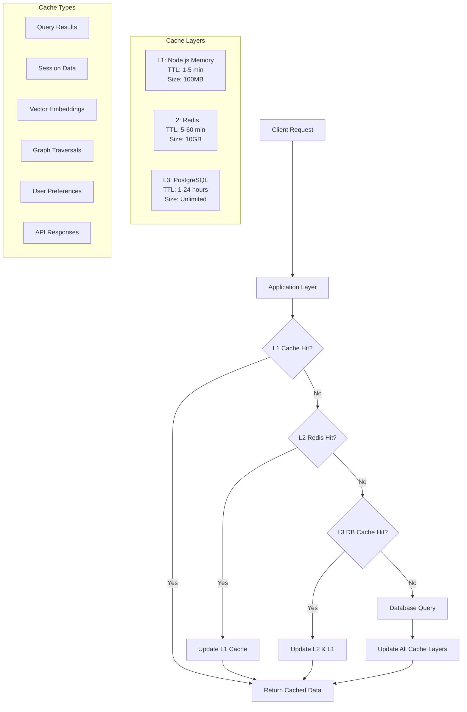

# Caching Strategies

This document outlines Hikma's comprehensive caching architecture using Redis, covering cache patterns, invalidation strategies, and performance optimization techniques.

## 🎯 Overview

Hikma implements a **multi-layered caching strategy** to optimize performance across different data access patterns:

1. **L1 Cache**: Application-level in-memory cache for hot data
2. **L2 Cache**: Redis-based distributed cache for warm data  
3. **L3 Cache**: Database query result cache for cold data
4. **CDN Cache**: Static asset and API response caching

## 🏗️ Cache Architecture



## 🗄️ Redis Configuration

### 1. Redis Setup and Configuration

**Production Redis Configuration**:
```redis
# Memory optimization
maxmemory 10gb
maxmemory-policy allkeys-lru
maxmemory-samples 10

# Persistence configuration
save 900 1
save 300 10
save 60 10000

# Network optimization
tcp-keepalive 300
timeout 0

# Performance tuning
hash-max-ziplist-entries 512
hash-max-ziplist-value 64
list-max-ziplist-size -2
set-max-intset-entries 512
zset-max-ziplist-entries 128
zset-max-ziplist-value 64

# Logging
loglevel notice
logfile /var/log/redis/redis-server.log
```

**Redis Connection Pool**:
```typescript
import Redis from 'ioredis';

class RedisManager {
  private static instance: RedisManager;
  private redis: Redis;
  private subscriber: Redis;
  private publisher: Redis;

  private constructor() {
    const config = {
      host: process.env.REDIS_HOST || 'localhost',
      port: parseInt(process.env.REDIS_PORT || '6379'),
      password: process.env.REDIS_PASSWORD,
      db: 0,
      retryDelayOnFailover: 100,
      maxRetriesPerRequest: 3,
      lazyConnect: true,
      keepAlive: 30000,
      family: 4,
      keyPrefix: 'hikma:',
      // Connection pool settings
      maxLoadingTimeout: 5000,
      // Cluster configuration for production
      enableOfflineQueue: false,
    };

    this.redis = new Redis(config);
    this.subscriber = new Redis({ ...config, keyPrefix: '' });
    this.publisher = new Redis({ ...config, keyPrefix: '' });
  }

  static getInstance(): RedisManager {
    if (!RedisManager.instance) {
      RedisManager.instance = new RedisManager();
    }
    return RedisManager.instance;
  }

  getClient(): Redis {
    return this.redis;
  }

  getSubscriber(): Redis {
    return this.subscriber;
  }

  getPublisher(): Redis {
    return this.publisher;
  }
}
```

## 🔄 Cache Patterns

### 1. Cache-Aside Pattern

**Query Result Caching**:
```typescript
class QueryCacheService {
  private redis = RedisManager.getInstance().getClient();
  private l1Cache = new Map<string, CacheEntry>();

  async getCachedQuery<T>(
    cacheKey: string,
    queryFn: () => Promise<T>,
    ttl: number = 300
  ): Promise<T> {
    // L1 Cache check
    const l1Entry = this.l1Cache.get(cacheKey);
    if (l1Entry && !this.isExpired(l1Entry)) {
      await this.recordCacheHit('l1', cacheKey);
      return l1Entry.data;
    }

    // L2 Redis cache check
    const cached = await this.redis.get(cacheKey);
    if (cached) {
      const data = JSON.parse(cached);
      // Update L1 cache
      this.l1Cache.set(cacheKey, {
        data,
        timestamp: Date.now(),
        ttl: Math.min(ttl, 300) // L1 has shorter TTL
      });
      await this.recordCacheHit('l2', cacheKey);
      return data;
    }

    // Cache miss - execute query
    const result = await queryFn();
    
    // Store in both cache layers
    await this.setCachedData(cacheKey, result, ttl);
    await this.recordCacheMiss(cacheKey);
    
    return result;
  }

  private async setCachedData<T>(
    key: string, 
    data: T, 
    ttl: number
  ): Promise<void> {
    // Store in Redis with TTL
    await this.redis.setex(key, ttl, JSON.stringify(data));
    
    // Store in L1 cache with shorter TTL
    this.l1Cache.set(key, {
      data,
      timestamp: Date.now(),
      ttl: Math.min(ttl, 300)
    });
  }
}
```

### 2. Write-Through Pattern

**User Session Management**:
```typescript
class SessionCacheService {
  private redis = RedisManager.getInstance().getClient();

  async createSession(userId: string, sessionData: SessionData): Promise<string> {
    const sessionId = this.generateSessionId();
    const sessionKey = `session:${sessionId}`;
    
    // Write to cache and database simultaneously
    await Promise.all([
      this.redis.hset(sessionKey, {
        user_id: userId,
        created_at: Date.now(),
        last_accessed: Date.now(),
        data: JSON.stringify(sessionData)
      }),
      this.redis.expire(sessionKey, 86400), // 24 hours
      this.database.sessions.create({
        id: sessionId,
        userId,
        data: sessionData,
        expiresAt: new Date(Date.now() + 86400000)
      })
    ]);

    return sessionId;
  }

  async updateSession(
    sessionId: string, 
    updates: Partial<SessionData>
  ): Promise<void> {
    const sessionKey = `session:${sessionId}`;
    
    // Update both cache and database
    await Promise.all([
      this.redis.hset(sessionKey, {
        last_accessed: Date.now(),
        data: JSON.stringify(updates)
      }),
      this.database.sessions.update({
        where: { id: sessionId },
        data: { 
          data: updates,
          lastAccessed: new Date()
        }
      })
    ]);
  }
}
```

### 3. Write-Behind Pattern

**Metrics Collection**:
```typescript
class MetricsCacheService {
  private redis = RedisManager.getInstance().getClient();
  private writeQueue = new Map<string, MetricData[]>();
  private flushInterval = 30000; // 30 seconds

  constructor() {
    // Start background flush process
    setInterval(() => this.flushMetrics(), this.flushInterval);
  }

  async recordMetric(name: string, value: number, labels: Record<string, string>): Promise<void> {
    const metricKey = `metric:${name}`;
    const timestamp = Date.now();
    
    // Immediately update cache
    await this.redis.zadd(
      metricKey,
      timestamp,
      JSON.stringify({ value, labels, timestamp })
    );
    
    // Queue for database write
    if (!this.writeQueue.has(name)) {
      this.writeQueue.set(name, []);
    }
    this.writeQueue.get(name)!.push({ name, value, labels, timestamp });
  }

  private async flushMetrics(): Promise<void> {
    const metricsToFlush = new Map(this.writeQueue);
    this.writeQueue.clear();

    for (const [metricName, metrics] of metricsToFlush) {
      try {
        await this.database.metrics.createMany({
          data: metrics.map(m => ({
            name: m.name,
            value: m.value,
            labels: m.labels,
            timestamp: new Date(m.timestamp)
          }))
        });
      } catch (error) {
        // Re-queue failed metrics
        if (!this.writeQueue.has(metricName)) {
          this.writeQueue.set(metricName, []);
        }
        this.writeQueue.get(metricName)!.push(...metrics);
      }
    }
  }
}
```

## 🎯 Specialized Caching

### 1. Vector Embedding Cache

**Embedding Result Caching**:
```typescript
class EmbeddingCacheService {
  private redis = RedisManager.getInstance().getClient();

  async getCachedEmbedding(
    text: string, 
    model: string
  ): Promise<number[] | null> {
    const textHash = this.hashText(text);
    const cacheKey = `embedding:${model}:${textHash}`;
    
    const cached = await this.redis.get(cacheKey);
    if (cached) {
      return JSON.parse(cached);
    }
    
    return null;
  }

  async setCachedEmbedding(
    text: string,
    model: string,
    embedding: number[]
  ): Promise<void> {
    const textHash = this.hashText(text);
    const cacheKey = `embedding:${model}:${textHash}`;
    
    // Cache embeddings for 7 days
    await this.redis.setex(
      cacheKey,
      604800,
      JSON.stringify(embedding)
    );
  }

  private hashText(text: string): string {
    return crypto
      .createHash('sha256')
      .update(text)
      .digest('hex')
      .substring(0, 16);
  }
}
```

### 2. Graph Query Cache

**Graph Traversal Result Caching**:
```typescript
class GraphCacheService {
  private redis = RedisManager.getInstance().getClient();

  async getCachedGraphQuery(
    query: string,
    parameters: Record<string, any>
  ): Promise<any[] | null> {
    const queryHash = this.hashQuery(query, parameters);
    const cacheKey = `graph:${queryHash}`;
    
    const cached = await this.redis.get(cacheKey);
    if (cached) {
      return JSON.parse(cached);
    }
    
    return null;
  }

  async setCachedGraphQuery(
    query: string,
    parameters: Record<string, any>,
    result: any[],
    ttl: number = 1800 // 30 minutes
  ): Promise<void> {
    const queryHash = this.hashQuery(query, parameters);
    const cacheKey = `graph:${queryHash}`;
    
    await this.redis.setex(cacheKey, ttl, JSON.stringify(result));
    
    // Track query for invalidation
    await this.redis.sadd('graph:queries', cacheKey);
  }

  private hashQuery(query: string, parameters: Record<string, any>): string {
    const combined = query + JSON.stringify(parameters);
    return crypto
      .createHash('md5')
      .update(combined)
      .digest('hex');
  }
}
```

### 3. API Response Cache

**HTTP Response Caching**:
```typescript
class APIResponseCache {
  private redis = RedisManager.getInstance().getClient();

  async middleware(
    request: FastifyRequest,
    reply: FastifyReply,
    next: () => void
  ): Promise<void> {
    // Only cache GET requests
    if (request.method !== 'GET') {
      return next();
    }

    const cacheKey = this.generateCacheKey(request);
    const cached = await this.redis.get(cacheKey);
    
    if (cached) {
      const { data, headers, statusCode } = JSON.parse(cached);
      reply.headers(headers);
      reply.status(statusCode);
      reply.send(data);
      return;
    }

    // Intercept response
    const originalSend = reply.send.bind(reply);
    reply.send = (payload: any) => {
      // Cache successful responses
      if (reply.statusCode >= 200 && reply.statusCode < 300) {
        this.cacheResponse(cacheKey, {
          data: payload,
          headers: reply.getHeaders(),
          statusCode: reply.statusCode
        });
      }
      return originalSend(payload);
    };

    next();
  }

  private generateCacheKey(request: FastifyRequest): string {
    const url = request.url;
    const userId = request.user?.id || 'anonymous';
    const projectId = request.project?.id || 'none';
    
    return `api:${userId}:${projectId}:${this.hashString(url)}`;
  }

  private async cacheResponse(
    key: string,
    response: CachedResponse
  ): Promise<void> {
    const ttl = this.getTTLForEndpoint(key);
    await this.redis.setex(key, ttl, JSON.stringify(response));
  }
}
```

## 🔄 Cache Invalidation

### 1. Event-Driven Invalidation

**Invalidation on Data Changes**:
```typescript
class CacheInvalidationService {
  private redis = RedisManager.getInstance().getClient();
  private publisher = RedisManager.getInstance().getPublisher();

  async invalidateOnDocumentChange(documentId: string): Promise<void> {
    const patterns = [
      `query:*:doc:${documentId}`,
      `search:*:${documentId}`,
      `graph:*:${documentId}`,
      `embedding:${documentId}:*`
    ];

    await this.invalidatePatterns(patterns);
    
    // Publish invalidation event
    await this.publisher.publish('cache:invalidate', JSON.stringify({
      type: 'document_change',
      documentId,
      timestamp: Date.now()
    }));
  }

  async invalidateOnProjectSync(projectId: string): Promise<void> {
    const patterns = [
      `query:*:proj:${projectId}`,
      `search:*:proj:${projectId}`,
      `api:*:${projectId}:*`,
      `metrics:project:${projectId}:*`
    ];

    await this.invalidatePatterns(patterns);
  }

  private async invalidatePatterns(patterns: string[]): Promise<void> {
    for (const pattern of patterns) {
      const keys = await this.redis.keys(pattern);
      if (keys.length > 0) {
        await this.redis.del(...keys);
      }
    }
  }
}
```

### 2. Time-Based Invalidation

**TTL Management**:
```typescript
class TTLManager {
  private redis = RedisManager.getInstance().getClient();

  private ttlConfig = {
    // Hot data - frequently accessed
    'session:*': 86400,        // 24 hours
    'user:*': 3600,           // 1 hour
    'query:recent:*': 1800,   // 30 minutes
    
    // Warm data - moderately accessed
    'search:*': 7200,         // 2 hours
    'graph:*': 3600,          // 1 hour
    'api:*': 1800,           // 30 minutes
    
    // Cold data - infrequently accessed
    'embedding:*': 604800,    // 7 days
    'metrics:*': 259200,      // 3 days
    'analytics:*': 86400      // 24 hours
  };

  async setTTL(key: string, customTTL?: number): Promise<void> {
    const ttl = customTTL || this.getTTLForKey(key);
    await this.redis.expire(key, ttl);
  }

  private getTTLForKey(key: string): number {
    for (const [pattern, ttl] of Object.entries(this.ttlConfig)) {
      if (this.matchesPattern(key, pattern)) {
        return ttl;
      }
    }
    return 3600; // Default 1 hour
  }

  private matchesPattern(key: string, pattern: string): boolean {
    const regex = new RegExp(pattern.replace('*', '.*'));
    return regex.test(key);
  }
}
```

### 3. Cache Warming

**Proactive Cache Population**:
```typescript
class CacheWarmingService {
  private redis = RedisManager.getInstance().getClient();

  async warmProjectCache(projectId: string): Promise<void> {
    const warmingTasks = [
      this.warmFrequentQueries(projectId),
      this.warmProjectMetadata(projectId),
      this.warmUserSessions(projectId),
      this.warmSearchIndices(projectId)
    ];

    await Promise.allSettled(warmingTasks);
  }

  private async warmFrequentQueries(projectId: string): Promise<void> {
    // Get most frequent queries from analytics
    const frequentQueries = await this.getFrequentQueries(projectId);
    
    for (const query of frequentQueries) {
      try {
        // Execute query and cache result
        const result = await this.queryService.executeQuery(query, projectId);
        const cacheKey = `query:${projectId}:${this.hashQuery(query)}`;
        await this.redis.setex(cacheKey, 3600, JSON.stringify(result));
      } catch (error) {
        console.warn(`Failed to warm cache for query: ${query}`, error);
      }
    }
  }

  private async warmProjectMetadata(projectId: string): Promise<void> {
    const metadata = await this.projectService.getProjectMetadata(projectId);
    const cacheKey = `project:${projectId}:metadata`;
    await this.redis.setex(cacheKey, 7200, JSON.stringify(metadata));
  }
}
```

## 📊 Cache Monitoring

### 1. Performance Metrics

**Cache Performance Tracking**:
```typescript
class CacheMetricsCollector {
  private redis = RedisManager.getInstance().getClient();

  async collectCacheMetrics(): Promise<CacheMetrics> {
    const info = await this.redis.info('memory');
    const stats = await this.redis.info('stats');
    
    return {
      memory: {
        used: this.parseInfoValue(info, 'used_memory'),
        peak: this.parseInfoValue(info, 'used_memory_peak'),
        fragmentation: this.parseInfoValue(info, 'mem_fragmentation_ratio')
      },
      operations: {
        hits: this.parseInfoValue(stats, 'keyspace_hits'),
        misses: this.parseInfoValue(stats, 'keyspace_misses'),
        hitRate: this.calculateHitRate(stats)
      },
      connections: {
        connected: this.parseInfoValue(stats, 'connected_clients'),
        blocked: this.parseInfoValue(stats, 'blocked_clients')
      }
    };
  }

  private calculateHitRate(stats: string): number {
    const hits = this.parseInfoValue(stats, 'keyspace_hits');
    const misses = this.parseInfoValue(stats, 'keyspace_misses');
    const total = hits + misses;
    
    return total > 0 ? (hits / total) * 100 : 0;
  }

  async recordCacheOperation(
    operation: 'hit' | 'miss' | 'set' | 'delete',
    cacheLayer: 'l1' | 'l2' | 'l3',
    key: string
  ): Promise<void> {
    const metricKey = `cache:metrics:${operation}:${cacheLayer}`;
    await this.redis.incr(metricKey);
    
    // Track key patterns
    const pattern = this.extractKeyPattern(key);
    const patternKey = `cache:patterns:${pattern}:${operation}`;
    await this.redis.incr(patternKey);
  }
}
```

### 2. Cache Health Monitoring

**Automated Cache Health Checks**:
```typescript
class CacheHealthMonitor {
  private redis = RedisManager.getInstance().getClient();

  async performHealthCheck(): Promise<HealthCheckResult> {
    const checks = await Promise.allSettled([
      this.checkConnectivity(),
      this.checkMemoryUsage(),
      this.checkHitRate(),
      this.checkKeyExpiration(),
      this.checkReplicationLag()
    ]);

    return {
      status: checks.every(c => c.status === 'fulfilled') ? 'healthy' : 'degraded',
      checks: checks.map((check, index) => ({
        name: ['connectivity', 'memory', 'hitRate', 'expiration', 'replication'][index],
        status: check.status,
        result: check.status === 'fulfilled' ? check.value : check.reason
      })),
      timestamp: new Date()
    };
  }

  private async checkMemoryUsage(): Promise<boolean> {
    const info = await this.redis.info('memory');
    const usedMemory = this.parseInfoValue(info, 'used_memory');
    const maxMemory = this.parseInfoValue(info, 'maxmemory');
    
    if (maxMemory === 0) return true; // No memory limit set
    
    const usagePercent = (usedMemory / maxMemory) * 100;
    return usagePercent < 90; // Alert if over 90% usage
  }

  private async checkHitRate(): Promise<boolean> {
    const stats = await this.redis.info('stats');
    const hitRate = this.calculateHitRate(stats);
    
    return hitRate > 70; // Alert if hit rate below 70%
  }
}
```

## 🔧 Cache Configuration

### 1. Environment-Specific Settings

**Development vs Production Configuration**:
```typescript
interface CacheConfig {
  redis: {
    host: string;
    port: number;
    password?: string;
    db: number;
    maxMemory: string;
    evictionPolicy: string;
  };
  l1Cache: {
    maxSize: number;
    defaultTTL: number;
  };
  ttl: {
    short: number;
    medium: number;
    long: number;
  };
}

const cacheConfigs: Record<string, CacheConfig> = {
  development: {
    redis: {
      host: 'localhost',
      port: 6379,
      db: 0,
      maxMemory: '1gb',
      evictionPolicy: 'allkeys-lru'
    },
    l1Cache: {
      maxSize: 100 * 1024 * 1024, // 100MB
      defaultTTL: 300 // 5 minutes
    },
    ttl: {
      short: 300,    // 5 minutes
      medium: 1800,  // 30 minutes
      long: 7200     // 2 hours
    }
  },
  production: {
    redis: {
      host: process.env.REDIS_HOST!,
      port: parseInt(process.env.REDIS_PORT!),
      password: process.env.REDIS_PASSWORD,
      db: 0,
      maxMemory: '10gb',
      evictionPolicy: 'allkeys-lru'
    },
    l1Cache: {
      maxSize: 500 * 1024 * 1024, // 500MB
      defaultTTL: 600 // 10 minutes
    },
    ttl: {
      short: 600,    // 10 minutes
      medium: 3600,  // 1 hour
      long: 86400    // 24 hours
    }
  }
};
```

### 2. Cache Key Strategies

**Consistent Key Naming Convention**:
```typescript
class CacheKeyBuilder {
  static buildKey(
    namespace: string,
    identifier: string,
    ...segments: string[]
  ): string {
    const parts = [namespace, identifier, ...segments].filter(Boolean);
    return parts.join(':');
  }

  static buildQueryKey(
    projectId: string,
    userId: string,
    queryHash: string
  ): string {
    return this.buildKey('query', projectId, userId, queryHash);
  }

  static buildSearchKey(
    projectId: string,
    searchType: string,
    queryHash: string
  ): string {
    return this.buildKey('search', projectId, searchType, queryHash);
  }

  static buildSessionKey(sessionId: string): string {
    return this.buildKey('session', sessionId);
  }

  static buildEmbeddingKey(
    model: string,
    textHash: string
  ): string {
    return this.buildKey('embedding', model, textHash);
  }
}
```

---

This comprehensive caching strategy ensures Hikma delivers optimal performance while maintaining data consistency and providing excellent user experience across all interaction patterns.