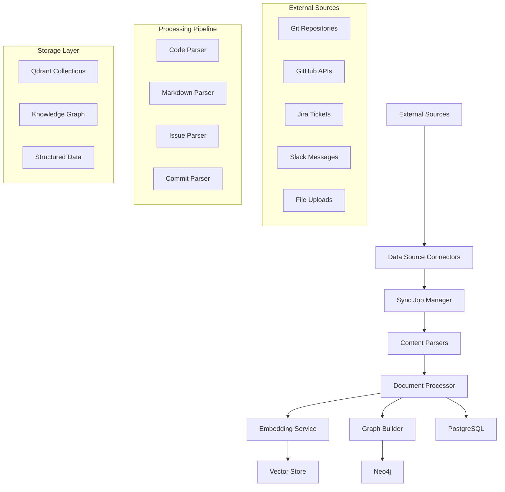
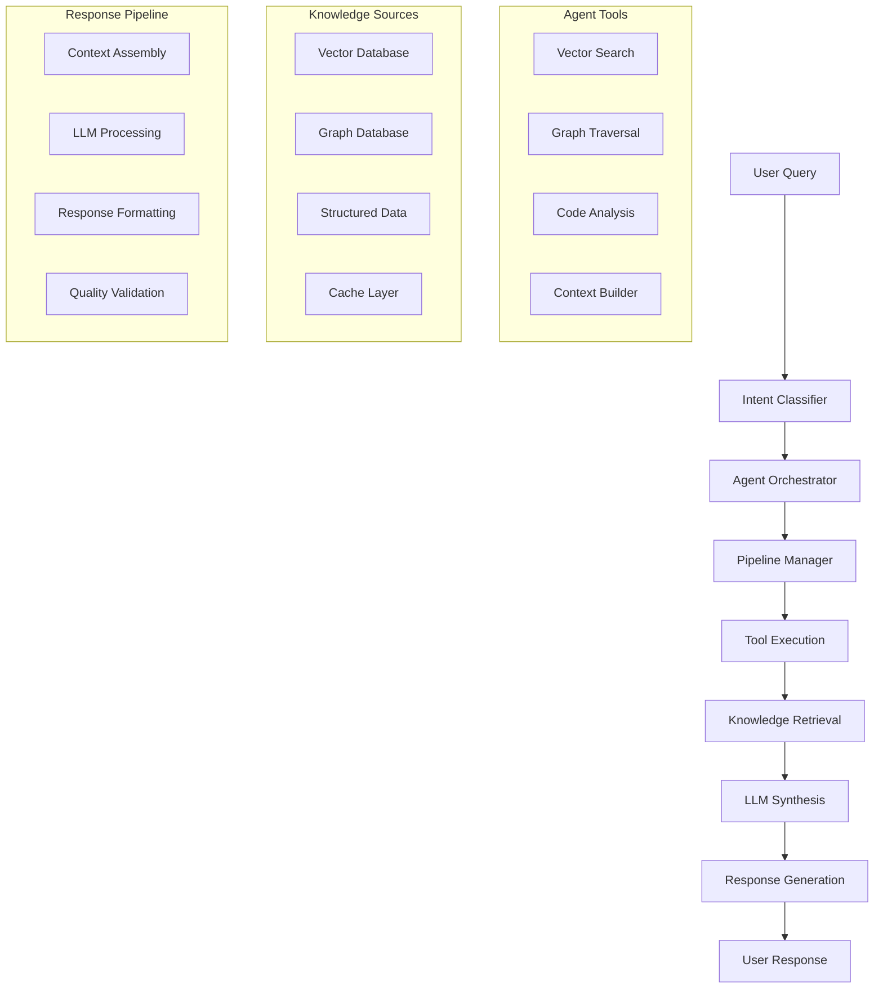
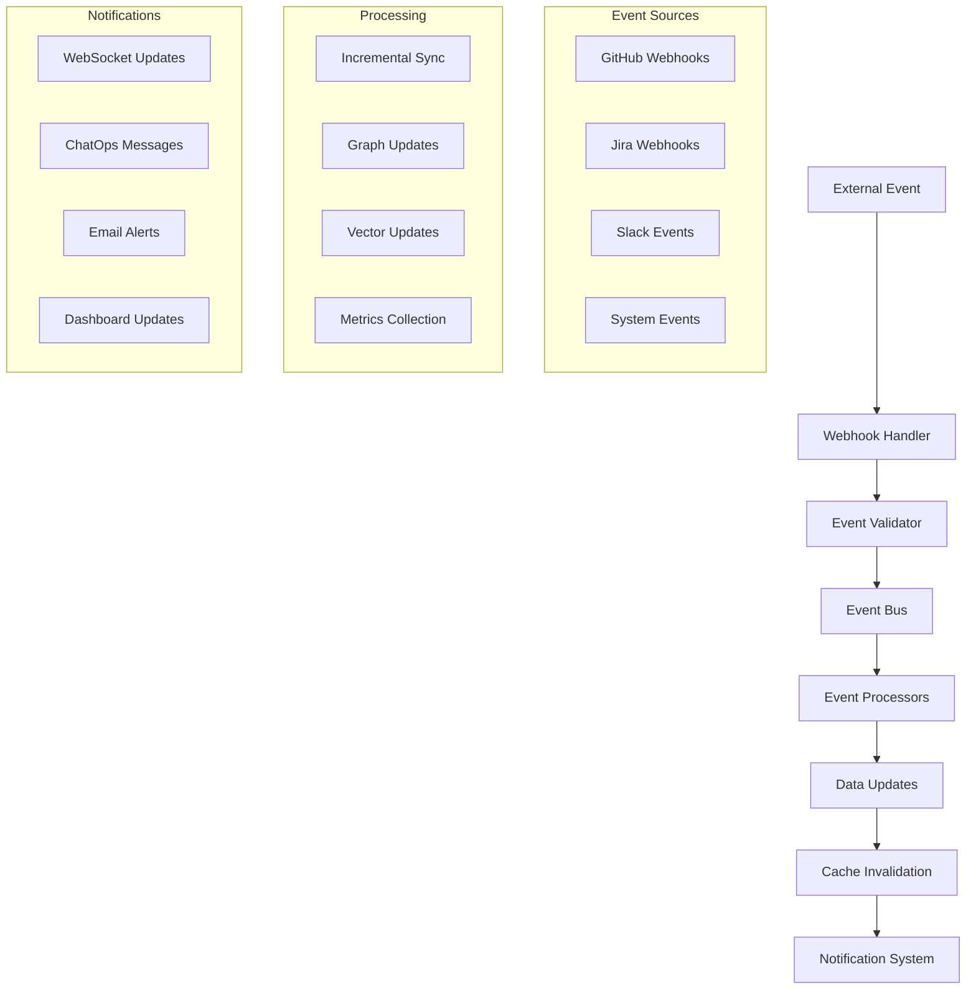

# Core Data Flow

This document describes the fundamental data flow patterns in Hikma's agentic code intelligence platform, covering the primary data processing pipelines and architectural patterns.

## 🏗️ Architecture Overview

Hikma implements a **Domain-Driven Design (DDD)** architecture with clear separation of concerns across multiple layers:

```
┌─────────────────────────────────────────────────────────────┐
│                    Interface Layer                          │
│  ┌─────────────┐ ┌─────────────┐ ┌─────────────┐          │
│  │   API       │ │  WebSocket  │ │   ChatOps   │          │
│  │  Routes     │ │   Handler   │ │ Integration │          │
│  └─────────────┘ └─────────────┘ └─────────────┘          │
└─────────────────────────────────────────────────────────────┘
                              │
┌─────────────────────────────────────────────────────────────┐
│                   Domain Layer                              │
│  ┌─────────────┐ ┌─────────────┐ ┌─────────────┐          │
│  │   Users     │ │  Projects   │ │  Analytics  │          │
│  │   Domain    │ │   Domain    │ │   Domain    │          │
│  └─────────────┘ └─────────────┘ └─────────────┘          │
└─────────────────────────────────────────────────────────────┘
                              │
┌─────────────────────────────────────────────────────────────┐
│                  Application Layer                          │
│  ┌─────────────┐ ┌─────────────┐ ┌─────────────┐          │
│  │   Agents    │ │  Knowledge  │ │  Workflow   │          │
│  │   Module    │ │   Module    │ │   Module    │          │
│  └─────────────┘ └─────────────┘ └─────────────┘          │
└─────────────────────────────────────────────────────────────┘
                              │
┌─────────────────────────────────────────────────────────────┐
│                Infrastructure Layer                         │
│  ┌─────────────┐ ┌─────────────┐ ┌─────────────┐          │
│  │ PostgreSQL  │ │   Qdrant    │ │    Neo4j    │          │
│  │   (RDBMS)   │ │  (Vectors)  │ │   (Graph)   │          │
│  └─────────────┘ └─────────────┘ └─────────────┘          │
│  ┌─────────────┐ ┌─────────────┐ ┌─────────────┐          │
│  │    Redis    │ │     LLM     │ │ Monitoring  │          │
│  │  (Cache)    │ │ Integration │ │   Stack     │          │
│  └─────────────┘ └─────────────┘ └─────────────┘          │
└─────────────────────────────────────────────────────────────┘
```

## 🔄 Primary Data Flow Patterns

### 1. Data Ingestion Flow

The data ingestion process follows a structured pipeline from external sources to processed knowledge:



**Flow Steps:**

1. **Source Configuration**: Data sources are configured per project with authentication and sync settings
2. **Sync Job Creation**: Scheduled or triggered sync jobs manage data pulling
3. **Content Extraction**: Raw content is extracted and normalized
4. **Document Processing**: Content is parsed, chunked, and enriched with metadata
5. **Embedding Generation**: Text chunks are converted to vector embeddings
6. **Multi-Store Persistence**: Data is stored across PostgreSQL, Qdrant, and Neo4j
7. **Index Updates**: Search indices and graph relationships are updated

### 2. Query Processing Flow

User queries are processed through an intelligent agent system:



**Flow Steps:**

1. **Query Reception**: User query is received and logged
2. **Intent Classification**: AI determines query intent and extracts entities
3. **Pipeline Selection**: Appropriate processing pipeline is selected
4. **Tool Orchestration**: Relevant tools are executed in sequence
5. **Knowledge Retrieval**: Information is gathered from multiple sources
6. **Context Assembly**: Retrieved information is assembled into context
7. **LLM Processing**: Large language model generates response
8. **Response Delivery**: Formatted response is returned to user

### 3. Real-time Update Flow

Real-time updates are handled through webhooks and event processing:



## 🗄️ Data Storage Strategy

### Multi-Database Architecture

Hikma uses a **polyglot persistence** approach, with each database optimized for specific use cases:

| Database | Purpose | Data Types | Access Patterns |
|----------|---------|------------|-----------------|
| **PostgreSQL** | Primary RDBMS | Users, Projects, Logs, Metadata | ACID transactions, Complex queries |
| **Qdrant** | Vector Database | Embeddings, Semantic search | Similarity search, Nearest neighbor |
| **Neo4j** | Graph Database | Relationships, Dependencies | Graph traversal, Pattern matching |
| **Redis** | Cache & Sessions | Temporary data, Sessions | Fast read/write, TTL-based |

### Data Consistency Model

- **Strong Consistency**: PostgreSQL for critical business data
- **Eventual Consistency**: Vector and graph databases for derived data
- **Cache Coherence**: Redis with TTL and invalidation strategies
- **Cross-Database Sync**: Event-driven synchronization between stores

## 🔧 Processing Modules

### Knowledge Module

Handles all aspects of content processing and knowledge extraction:

```typescript
// Core services in knowledge module
knowledge/
├── ingestion/
│   ├── connectors/          # Data source connectors
│   ├── parsers/            # Content parsers
│   └── processors/         # Document processors
├── embeddings/             # Vector embedding generation
├── graph/                  # Graph relationship building
├── retrieval/              # Search and retrieval
└── services/               # Core knowledge services
```

**Key Responsibilities:**
- Content ingestion from multiple sources
- Document parsing and chunking
- Vector embedding generation
- Graph relationship extraction
- Search index maintenance

### Agents Module

Implements the AI agent system for intelligent query processing:

```typescript
// Core services in agents module
agents/
├── services/
│   ├── agent-orchestrator.ts    # Main orchestration logic
│   ├── intent-classifier.ts     # Query intent detection
│   ├── pipeline-manager.ts      # Processing pipeline management
│   └── llm-service.ts           # LLM integration
├── tools/                       # Agent tools
├── pipelines/                   # Processing pipelines
└── synthesis/                   # Response synthesis
```

**Key Responsibilities:**
- Query intent classification
- Agent tool orchestration
- Pipeline execution management
- Response synthesis and formatting

### Workflow Module

Manages automated workflows and integrations:

```typescript
// Core services in workflow module
workflow/
├── triggers/               # Event triggers
├── actions/               # Workflow actions
├── integrations/          # External integrations
└── services/              # Workflow orchestration
```

**Key Responsibilities:**
- Webhook event processing
- Automated workflow execution
- External system integration
- Notification management

## 📊 Data Flow Metrics

### Performance Indicators

- **Ingestion Rate**: Documents processed per minute
- **Query Latency**: Average response time for user queries
- **Cache Hit Rate**: Percentage of requests served from cache
- **Sync Success Rate**: Percentage of successful data synchronizations
- **Vector Search Accuracy**: Relevance scores for semantic search

### Monitoring Points

1. **Ingestion Pipeline**: Document processing rates and error rates
2. **Query Processing**: Response times and success rates
3. **Database Performance**: Query execution times and connection pools
4. **Cache Performance**: Hit rates and eviction patterns
5. **External APIs**: Rate limits and response times

## 🔄 Error Handling & Recovery

### Resilience Patterns

- **Circuit Breaker**: Prevents cascade failures in external API calls
- **Retry Logic**: Exponential backoff for transient failures
- **Dead Letter Queue**: Failed messages for manual inspection
- **Graceful Degradation**: Fallback responses when services are unavailable

### Data Integrity

- **Transactional Boundaries**: ACID compliance for critical operations
- **Idempotent Operations**: Safe retry of processing operations
- **Consistency Checks**: Regular validation of cross-database consistency
- **Backup & Recovery**: Automated backup and point-in-time recovery

## 🚀 Scalability Considerations

### Horizontal Scaling

- **Stateless Services**: All application services are stateless
- **Database Sharding**: Partition data by project for horizontal scaling
- **Load Balancing**: Distribute requests across multiple instances
- **Async Processing**: Queue-based processing for heavy operations

### Performance Optimization

- **Connection Pooling**: Efficient database connection management
- **Batch Processing**: Bulk operations for improved throughput
- **Lazy Loading**: Load data only when needed
- **Compression**: Reduce storage and network overhead

---

This core data flow architecture provides the foundation for Hikma's intelligent code analysis capabilities while maintaining scalability, reliability, and performance.