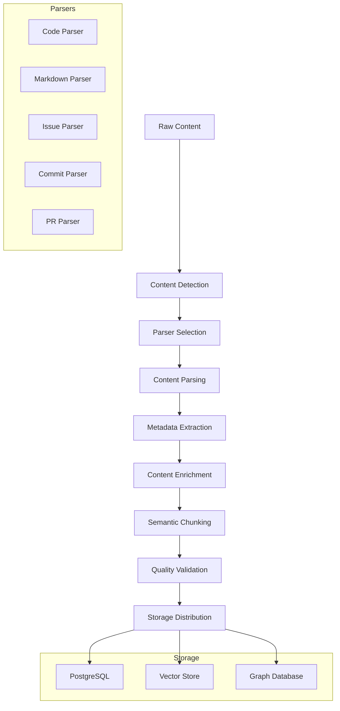

# Document Processing

This document explains Hikma's document processing pipeline, covering how raw content is transformed into searchable, intelligent knowledge.

## 🎯 Overview

Document processing transforms raw content from various sources into structured, searchable knowledge through:
- **Content Parsing**: Language-specific parsing and analysis
- **Semantic Chunking**: Intelligent content segmentation
- **Metadata Extraction**: Rich context and relationship data
- **Multi-format Support**: Code, documentation, issues, and more

## 🔄 Processing Pipeline



## 📝 Content Parsers

### 1. Code File Parser

**TypeScript/JavaScript Parser**:
```typescript
class TypeScriptParser implements ContentParser {
  async parse(content: string, filePath: string): Promise<ParsedDocument> {
    const sourceFile = ts.createSourceFile(
      filePath,
      content,
      ts.ScriptTarget.Latest,
      true
    );

    const entities = {
      imports: this.extractImports(sourceFile),
      exports: this.extractExports(sourceFile),
      classes: this.extractClasses(sourceFile),
      interfaces: this.extractInterfaces(sourceFile),
      functions: this.extractFunctions(sourceFile),
      variables: this.extractVariables(sourceFile),
      types: this.extractTypes(sourceFile)
    };

    const complexity = this.calculateComplexity(sourceFile);
    const dependencies = this.extractDependencies(entities.imports);

    return {
      type: 'CODE_FILE',
      language: 'typescript',
      entities,
      complexity,
      dependencies,
      documentation: this.extractDocumentation(sourceFile),
      metrics: {
        linesOfCode: content.split('\n').length,
        cyclomaticComplexity: complexity.cyclomatic,
        maintainabilityIndex: complexity.maintainability
      }
    };
  }

  private extractFunctions(sourceFile: ts.SourceFile): FunctionEntity[] {
    const functions: FunctionEntity[] = [];

    const visit = (node: ts.Node) => {
      if (ts.isFunctionDeclaration(node) || ts.isMethodDeclaration(node)) {
        functions.push({
          name: node.name?.getText() || 'anonymous',
          startLine: this.getLineNumber(sourceFile, node.getStart()),
          endLine: this.getLineNumber(sourceFile, node.getEnd()),
          parameters: this.extractParameters(node),
          returnType: this.extractReturnType(node),
          visibility: this.getVisibility(node),
          isAsync: this.isAsync(node),
          complexity: this.calculateFunctionComplexity(node),
          documentation: this.extractJSDoc(node)
        });
      }
      ts.forEachChild(node, visit);
    };

    visit(sourceFile);
    return functions;
  }

  private extractClasses(sourceFile: ts.SourceFile): ClassEntity[] {
    const classes: ClassEntity[] = [];

    const visit = (node: ts.Node) => {
      if (ts.isClassDeclaration(node)) {
        classes.push({
          name: node.name?.getText() || 'anonymous',
          startLine: this.getLineNumber(sourceFile, node.getStart()),
          endLine: this.getLineNumber(sourceFile, node.getEnd()),
          methods: this.extractMethods(node),
          properties: this.extractProperties(node),
          extends: this.extractExtends(node),
          implements: this.extractImplements(node),
          visibility: this.getVisibility(node),
          isAbstract: this.isAbstract(node),
          documentation: this.extractJSDoc(node)
        });
      }
      ts.forEachChild(node, visit);
    };

    visit(sourceFile);
    return classes;
  }
}
```

**Python Parser**:
```typescript
class PythonParser implements ContentParser {
  async parse(content: string, filePath: string): Promise<ParsedDocument> {
    // Use Python AST via child process or Python integration
    const astResult = await this.executePythonAST(content);
    
    return {
      type: 'CODE_FILE',
      language: 'python',
      entities: {
        imports: astResult.imports,
        classes: astResult.classes,
        functions: astResult.functions,
        variables: astResult.variables
      },
      complexity: this.calculatePythonComplexity(astResult),
      dependencies: this.extractPythonDependencies(astResult.imports)
    };
  }

  private async executePythonAST(content: string): Promise<PythonAST> {
    const pythonScript = `
import ast
import json
import sys

def extract_ast_info(source_code):
    tree = ast.parse(source_code)
    
    result = {
        'imports': [],
        'classes': [],
        'functions': [],
        'variables': []
    }
    
    for node in ast.walk(tree):
        if isinstance(node, ast.Import):
            for alias in node.names:
                result['imports'].append({
                    'name': alias.name,
                    'alias': alias.asname,
                    'line': node.lineno
                })
        elif isinstance(node, ast.FunctionDef):
            result['functions'].append({
                'name': node.name,
                'line': node.lineno,
                'args': [arg.arg for arg in node.args.args],
                'decorators': [d.id for d in node.decorator_list if hasattr(d, 'id')]
            })
        elif isinstance(node, ast.ClassDef):
            result['classes'].append({
                'name': node.name,
                'line': node.lineno,
                'bases': [base.id for base in node.bases if hasattr(base, 'id')],
                'methods': [n.name for n in node.body if isinstance(n, ast.FunctionDef)]
            })
    
    return result

source = sys.stdin.read()
result = extract_ast_info(source)
print(json.dumps(result))
    `;

    const result = await this.executeCommand('python3', ['-c', pythonScript], content);
    return JSON.parse(result);
  }
}
```

### 2. Markdown Parser

**Structured Document Processing**:
```typescript
class MarkdownParser implements ContentParser {
  async parse(content: string, filePath: string): Promise<ParsedDocument> {
    const tokens = marked.lexer(content);
    const structure = this.buildDocumentStructure(tokens);
    
    return {
      type: 'MARKDOWN',
      language: 'markdown',
      structure,
      headings: this.extractHeadings(tokens),
      codeBlocks: this.extractCodeBlocks(tokens),
      links: this.extractLinks(tokens),
      images: this.extractImages(tokens),
      tables: this.extractTables(tokens),
      metadata: this.extractFrontmatter(content)
    };
  }

  private buildDocumentStructure(tokens: marked.Token[]): DocumentStructure {
    const structure: DocumentStructure = {
      sections: [],
      toc: []
    };

    let currentSection: DocumentSection | null = null;
    let headingStack: DocumentHeading[] = [];

    for (const token of tokens) {
      switch (token.type) {
        case 'heading':
          const heading: DocumentHeading = {
            level: token.depth,
            text: token.text,
            id: this.generateHeadingId(token.text),
            line: this.getTokenLine(token)
          };

          // Update heading hierarchy
          headingStack = headingStack.filter(h => h.level < heading.level);
          headingStack.push(heading);

          // Create new section
          if (currentSection) {
            structure.sections.push(currentSection);
          }

          currentSection = {
            heading,
            content: '',
            subsections: [],
            codeBlocks: [],
            links: []
          };

          structure.toc.push({
            ...heading,
            parent: headingStack[headingStack.length - 2]?.id
          });
          break;

        case 'paragraph':
        case 'text':
          if (currentSection) {
            currentSection.content += token.raw + '\n';
          }
          break;

        case 'code':
          const codeBlock: CodeBlock = {
            language: token.lang || 'text',
            code: token.text,
            line: this.getTokenLine(token)
          };

          if (currentSection) {
            currentSection.codeBlocks.push(codeBlock);
          }
          break;
      }
    }

    if (currentSection) {
      structure.sections.push(currentSection);
    }

    return structure;
  }

  private extractCodeBlocks(tokens: marked.Token[]): CodeBlock[] {
    return tokens
      .filter(token => token.type === 'code')
      .map(token => ({
        language: (token as marked.Tokens.Code).lang || 'text',
        code: (token as marked.Tokens.Code).text,
        line: this.getTokenLine(token)
      }));
  }
}
```

### 3. Issue and PR Parser

**GitHub Issue Processing**:
```typescript
class IssueParser implements ContentParser {
  async parse(issueData: GitHubIssue): Promise<ParsedDocument> {
    const body = issueData.body || '';
    const comments = issueData.comments || [];

    // Extract structured information
    const bugReport = this.extractBugReport(body);
    const featureRequest = this.extractFeatureRequest(body);
    const codeReferences = this.extractCodeReferences(body);
    const relatedIssues = this.extractRelatedIssues(body);

    // Process comments
    const processedComments = comments.map(comment => ({
      author: comment.user.login,
      body: comment.body,
      createdAt: new Date(comment.created_at),
      codeReferences: this.extractCodeReferences(comment.body),
      sentiment: this.analyzeSentiment(comment.body)
    }));

    return {
      type: 'ISSUE',
      title: issueData.title,
      body,
      author: issueData.user.login,
      state: issueData.state,
      labels: issueData.labels.map(l => l.name),
      assignees: issueData.assignees.map(a => a.login),
      milestone: issueData.milestone?.title,
      comments: processedComments,
      analysis: {
        type: this.classifyIssueType(issueData),
        priority: this.estimatePriority(issueData),
        complexity: this.estimateComplexity(body),
        bugReport,
        featureRequest,
        codeReferences,
        relatedIssues
      }
    };
  }

  private extractBugReport(body: string): BugReport | null {
    // Look for bug report templates
    const stepsMatch = body.match(/steps to reproduce:?\s*(.*?)(?=\n\n|\n#|$)/is);
    const expectedMatch = body.match(/expected behavior:?\s*(.*?)(?=\n\n|\n#|$)/is);
    const actualMatch = body.match(/actual behavior:?\s*(.*?)(?=\n\n|\n#|$)/is);

    if (stepsMatch || expectedMatch || actualMatch) {
      return {
        stepsToReproduce: stepsMatch?.[1]?.trim(),
        expectedBehavior: expectedMatch?.[1]?.trim(),
        actualBehavior: actualMatch?.[1]?.trim(),
        environment: this.extractEnvironmentInfo(body)
      };
    }

    return null;
  }

  private extractCodeReferences(text: string): CodeReference[] {
    const references: CodeReference[] = [];

    // Extract file paths
    const filePathRegex = /(?:^|\s)([a-zA-Z0-9_\-./]+\.[a-zA-Z]{1,4})(?:\s|$)/gm;
    let match;
    while ((match = filePathRegex.exec(text)) !== null) {
      references.push({
        type: 'file',
        value: match[1],
        context: this.getContext(text, match.index, 50)
      });
    }

    // Extract function/method names
    const functionRegex = /(?:function|method|class)\s+([a-zA-Z_][a-zA-Z0-9_]*)/gi;
    while ((match = functionRegex.exec(text)) !== null) {
      references.push({
        type: 'function',
        value: match[1],
        context: this.getContext(text, match.index, 50)
      });
    }

    return references;
  }
}
```

## 🧩 Semantic Chunking

### 1. Code-Aware Chunking

**Function and Class Boundaries**:
```typescript
class CodeAwareChunker implements DocumentChunker {
  async chunk(document: ParsedDocument): Promise<DocumentChunk[]> {
    if (document.type !== 'CODE_FILE') {
      return this.defaultChunk(document);
    }

    const chunks: DocumentChunk[] = [];
    const { entities, content } = document;

    // Create chunks for each function
    for (const func of entities.functions) {
      const chunkContent = this.extractFunctionContent(content, func);
      
      chunks.push({
        id: `${document.id}_func_${func.name}`,
        type: 'function',
        content: chunkContent,
        metadata: {
          name: func.name,
          startLine: func.startLine,
          endLine: func.endLine,
          complexity: func.complexity,
          parameters: func.parameters,
          returnType: func.returnType
        }
      });
    }

    // Create chunks for each class
    for (const cls of entities.classes) {
      const chunkContent = this.extractClassContent(content, cls);
      
      chunks.push({
        id: `${document.id}_class_${cls.name}`,
        type: 'class',
        content: chunkContent,
        metadata: {
          name: cls.name,
          startLine: cls.startLine,
          endLine: cls.endLine,
          methods: cls.methods.map(m => m.name),
          properties: cls.properties.map(p => p.name)
        }
      });
    }

    // Create chunks for imports and exports
    if (entities.imports.length > 0) {
      chunks.push({
        id: `${document.id}_imports`,
        type: 'imports',
        content: this.buildImportsContent(entities.imports),
        metadata: {
          dependencies: entities.imports.map(i => i.module)
        }
      });
    }

    return chunks;
  }

  private extractFunctionContent(content: string, func: FunctionEntity): string {
    const lines = content.split('\n');
    const functionLines = lines.slice(func.startLine - 1, func.endLine);
    
    // Add context
    const contextLines = Math.min(3, func.startLine - 1);
    const beforeContext = lines.slice(func.startLine - 1 - contextLines, func.startLine - 1);
    
    return [
      `Function: ${func.name}`,
      `Parameters: ${func.parameters.join(', ')}`,
      `Return Type: ${func.returnType}`,
      func.documentation ? `Documentation: ${func.documentation}` : '',
      '',
      'Context:',
      ...beforeContext,
      '',
      'Implementation:',
      ...functionLines
    ].filter(Boolean).join('\n');
  }
}
```

### 2. Markdown Section Chunking

**Hierarchical Content Segmentation**:
```typescript
class MarkdownChunker implements DocumentChunker {
  async chunk(document: ParsedDocument): Promise<DocumentChunk[]> {
    const chunks: DocumentChunk[] = [];
    const { structure } = document;

    for (const section of structure.sections) {
      // Create main section chunk
      chunks.push({
        id: `${document.id}_section_${section.heading.id}`,
        type: 'section',
        content: this.buildSectionContent(section),
        metadata: {
          heading: section.heading.text,
          level: section.heading.level,
          hasCodeBlocks: section.codeBlocks.length > 0,
          linkCount: section.links.length
        }
      });

      // Create separate chunks for code blocks
      for (const codeBlock of section.codeBlocks) {
        chunks.push({
          id: `${document.id}_code_${section.heading.id}_${codeBlock.line}`,
          type: 'code_block',
          content: this.buildCodeBlockContent(codeBlock, section.heading.text),
          metadata: {
            language: codeBlock.language,
            section: section.heading.text,
            line: codeBlock.line
          }
        });
      }
    }

    return chunks;
  }

  private buildSectionContent(section: DocumentSection): string {
    return [
      `# ${section.heading.text}`,
      '',
      section.content,
      section.links.length > 0 ? '\nReferences:' : '',
      ...section.links.map(link => `- [${link.text}](${link.url})`)
    ].filter(Boolean).join('\n');
  }
}
```

## 🔍 Quality Validation

### 1. Content Quality Checks

**Validation Pipeline**:
```typescript
class ContentValidator {
  async validate(document: ParsedDocument): Promise<ValidationResult> {
    const checks = [
      this.validateContentLength(document),
      this.validateLanguageDetection(document),
      this.validateStructure(document),
      this.validateMetadata(document),
      this.validateDuplication(document)
    ];

    const results = await Promise.all(checks);
    const issues = results.filter(r => !r.passed);

    return {
      passed: issues.length === 0,
      score: this.calculateQualityScore(results),
      issues,
      recommendations: this.generateRecommendations(issues)
    };
  }

  private async validateContentLength(document: ParsedDocument): Promise<ValidationCheck> {
    const minLength = 50;
    const maxLength = 1000000; // 1MB
    const length = document.content?.length || 0;

    return {
      name: 'content_length',
      passed: length >= minLength && length <= maxLength,
      message: length < minLength 
        ? `Content too short (${length} chars, minimum ${minLength})`
        : length > maxLength 
        ? `Content too long (${length} chars, maximum ${maxLength})`
        : 'Content length acceptable',
      severity: length < minLength ? 'error' : length > maxLength ? 'warning' : 'info'
    };
  }

  private async validateDuplication(document: ParsedDocument): Promise<ValidationCheck> {
    const contentHash = this.calculateContentHash(document.content);
    const existingDoc = await this.findDocumentByHash(contentHash);

    return {
      name: 'duplication',
      passed: !existingDoc,
      message: existingDoc 
        ? `Duplicate content detected (matches ${existingDoc.id})`
        : 'No duplicate content found',
      severity: existingDoc ? 'warning' : 'info'
    };
  }
}
```

### 2. Processing Metrics

**Performance and Quality Tracking**:
```typescript
class ProcessingMetrics {
  async recordProcessingMetrics(
    document: ParsedDocument,
    processingTime: number,
    validation: ValidationResult
  ): Promise<void> {
    await this.metricsService.record([
      {
        name: 'document_processing_duration',
        value: processingTime,
        labels: {
          type: document.type,
          language: document.language,
          size_category: this.categorizeSize(document.content?.length || 0)
        }
      },
      {
        name: 'document_quality_score',
        value: validation.score,
        labels: {
          type: document.type,
          passed: validation.passed.toString()
        }
      },
      {
        name: 'document_chunk_count',
        value: document.chunks?.length || 0,
        labels: {
          type: document.type
        }
      }
    ]);
  }

  private categorizeSize(size: number): string {
    if (size < 1000) return 'small';
    if (size < 10000) return 'medium';
    if (size < 100000) return 'large';
    return 'xlarge';
  }
}
```

This document processing system ensures that Hikma can intelligently parse, understand, and organize content from diverse sources while maintaining high quality and performance standards.