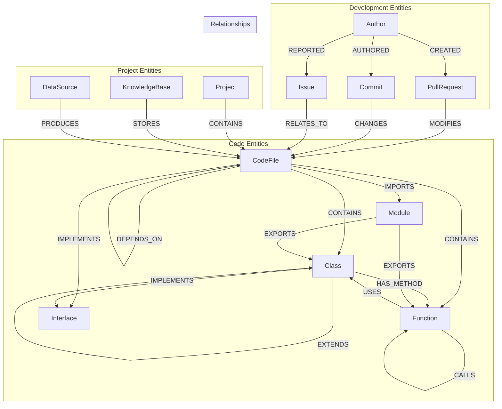

# Graph Data Model

This document describes Hikma's graph database implementation using Neo4j, covering node types, relationship patterns, and graph traversal strategies for code intelligence and dependency analysis.

## 🎯 Overview

Hikma uses Neo4j to model complex relationships between code entities, enabling powerful graph-based queries for:
- **Dependency Analysis**: Understanding code dependencies and impact analysis
- **Code Navigation**: Finding related functions, classes, and modules
- **Architecture Insights**: Visualizing system architecture and component relationships
- **Change Impact**: Analyzing the ripple effects of code changes

## 🏗️ Graph Schema



## 📊 Node Types

### 1. Code Entity Nodes

#### CodeFile Node
```cypher
CREATE (cf:CodeFile {
  id: "file_123",
  path: "/src/services/user-service.ts",
  name: "user-service.ts",
  extension: ".ts",
  language: "typescript",
  size: 2048,
  lines_of_code: 85,
  complexity_score: 12.5,
  last_modified: datetime("2024-01-15T10:30:00Z"),
  created_at: datetime("2024-01-01T09:00:00Z"),
  project_id: "proj_456",
  knowledge_base_id: "kb_789"
})
```

#### Class Node
```cypher
CREATE (cl:Class {
  id: "class_123",
  name: "UserService",
  full_name: "services.UserService",
  visibility: "public",
  is_abstract: false,
  is_interface: false,
  method_count: 8,
  property_count: 3,
  complexity_score: 15.2,
  start_line: 10,
  end_line: 120,
  documentation: "Service class for user management operations"
})
```

#### Function Node
```cypher
CREATE (fn:Function {
  id: "func_123",
  name: "createUser",
  full_name: "UserService.createUser",
  visibility: "public",
  is_async: true,
  is_static: false,
  parameter_count: 3,
  return_type: "Promise<User>",
  complexity_score: 8.5,
  start_line: 25,
  end_line: 45,
  documentation: "Creates a new user with validation"
})
```

#### Interface Node
```cypher
CREATE (if:Interface {
  id: "interface_123",
  name: "IUserRepository",
  full_name: "interfaces.IUserRepository",
  method_count: 5,
  property_count: 0,
  extends_count: 1,
  documentation: "Repository interface for user data operations"
})
```

#### Module Node
```cypher
CREATE (md:Module {
  id: "module_123",
  name: "user-module",
  path: "/src/modules/user",
  type: "es6",
  export_count: 12,
  import_count: 8,
  dependency_count: 15,
  is_entry_point: false
})
```

### 2. Development Entity Nodes

#### PullRequest Node
```cypher
CREATE (pr:PullRequest {
  id: "pr_123",
  number: 456,
  title: "Add user authentication feature",
  description: "Implements JWT-based authentication...",
  state: "merged",
  author: "john.doe",
  created_at: datetime("2024-01-10T14:30:00Z"),
  merged_at: datetime("2024-01-12T16:45:00Z"),
  files_changed: 12,
  additions: 245,
  deletions: 67,
  project_id: "proj_456"
})
```

#### Commit Node
```cypher
CREATE (cm:Commit {
  id: "commit_123",
  sha: "a1b2c3d4e5f6",
  message: "feat: implement user authentication",
  author: "john.doe",
  author_email: "john@example.com",
  committed_at: datetime("2024-01-11T10:15:00Z"),
  files_changed: 5,
  additions: 123,
  deletions: 23,
  project_id: "proj_456"
})
```

#### Issue Node
```cypher
CREATE (is:Issue {
  id: "issue_123",
  number: 789,
  title: "Authentication fails for special characters",
  description: "Users with special characters in username...",
  state: "closed",
  priority: "high",
  labels: ["bug", "authentication"],
  author: "jane.smith",
  created_at: datetime("2024-01-08T09:20:00Z"),
  closed_at: datetime("2024-01-15T11:30:00Z"),
  project_id: "proj_456"
})
```

#### Author Node
```cypher
CREATE (au:Author {
  id: "author_123",
  name: "John Doe",
  email: "john@example.com",
  username: "john.doe",
  commit_count: 156,
  pr_count: 23,
  issue_count: 8,
  first_contribution: datetime("2023-06-01T00:00:00Z"),
  last_activity: datetime("2024-01-15T16:30:00Z")
})
```

### 3. Project Entity Nodes

#### Project Node
```cypher
CREATE (pj:Project {
  id: "proj_456",
  name: "Hikma Platform",
  slug: "hikma-platform",
  description: "AI-powered code intelligence platform",
  primary_language: "typescript",
  languages: ["typescript", "javascript", "python"],
  file_count: 1250,
  line_count: 45000,
  created_at: datetime("2023-01-01T00:00:00Z")
})
```

## 🔗 Relationship Types

### 1. Code Structure Relationships

#### CONTAINS
```cypher
// File contains classes and functions
(file:CodeFile)-[:CONTAINS {
  start_line: 25,
  end_line: 120,
  created_at: datetime()
}]->(class:Class)

// Class contains methods
(class:Class)-[:CONTAINS {
  visibility: "private",
  is_inherited: false
}]->(method:Function)
```

#### IMPORTS/EXPORTS
```cypher
// File imports from module
(file:CodeFile)-[:IMPORTS {
  import_type: "named",
  imported_names: ["UserService", "validateUser"],
  line_number: 3
}]->(module:Module)

// Module exports class
(module:Module)-[:EXPORTS {
  export_type: "default",
  is_re_export: false
}]->(class:Class)
```

#### DEPENDS_ON
```cypher
// File depends on another file
(file1:CodeFile)-[:DEPENDS_ON {
  dependency_type: "direct",
  strength: 0.8,
  reason: "imports and uses classes"
}]->(file2:CodeFile)
```

### 2. Code Behavior Relationships

#### CALLS
```cypher
// Function calls another function
(caller:Function)-[:CALLS {
  call_count: 3,
  is_recursive: false,
  call_type: "direct",
  line_numbers: [45, 67, 89]
}]->(callee:Function)
```

#### IMPLEMENTS
```cypher
// Class implements interface
(class:Class)-[:IMPLEMENTS {
  implementation_completeness: 1.0,
  missing_methods: []
}]->(interface:Interface)
```

#### EXTENDS
```cypher
// Class extends another class
(child:Class)-[:EXTENDS {
  inheritance_depth: 2,
  overridden_methods: ["toString", "validate"]
}]->(parent:Class)
```

### 3. Development Workflow Relationships

#### MODIFIES
```cypher
// Pull request modifies files
(pr:PullRequest)-[:MODIFIES {
  change_type: "modified",
  lines_added: 45,
  lines_removed: 12,
  complexity_change: 2.3
}]->(file:CodeFile)
```

#### CHANGES
```cypher
// Commit changes files
(commit:Commit)-[:CHANGES {
  change_type: "modified",
  lines_added: 23,
  lines_removed: 5,
  hunks: 3
}]->(file:CodeFile)
```

#### RELATES_TO
```cypher
// Issue relates to code files
(issue:Issue)-[:RELATES_TO {
  relation_type: "bug_report",
  confidence: 0.9,
  mentioned_in: "description"
}]->(file:CodeFile)
```

## 🔍 Graph Queries and Patterns

### 1. Dependency Analysis

**Find All Dependencies of a File**:
```cypher
MATCH (file:CodeFile {path: "/src/services/user-service.ts"})
MATCH (file)-[:DEPENDS_ON*1..3]->(dependency:CodeFile)
RETURN file.path as source, 
       dependency.path as dependency, 
       length(path) as depth
ORDER BY depth, dependency.path
```

**Circular Dependency Detection**:
```cypher
MATCH (file1:CodeFile)-[:DEPENDS_ON*2..10]->(file2:CodeFile)
WHERE file1 = file2
RETURN file1.path as circular_dependency,
       [node in nodes(path) | node.path] as dependency_chain
```

**Impact Analysis for File Changes**:
```cypher
MATCH (changed_file:CodeFile {path: $file_path})
MATCH (affected_file:CodeFile)-[:DEPENDS_ON*1..5]->(changed_file)
RETURN affected_file.path as affected_file,
       affected_file.complexity_score as complexity,
       length(path) as impact_distance
ORDER BY impact_distance, complexity DESC
```

### 2. Code Navigation

**Find Related Functions**:
```cypher
MATCH (func:Function {name: $function_name})
MATCH (func)-[:CALLS|CALLED_BY*1..2]-(related:Function)
WHERE related <> func
RETURN related.name as related_function,
       related.full_name as full_name,
       type(relationship) as relationship_type,
       related.complexity_score as complexity
ORDER BY complexity DESC
```

**Class Hierarchy Traversal**:
```cypher
MATCH (class:Class {name: $class_name})
OPTIONAL MATCH (class)-[:EXTENDS*1..5]->(parent:Class)
OPTIONAL MATCH (child:Class)-[:EXTENDS*1..5]->(class)
RETURN class.name as focus_class,
       collect(DISTINCT parent.name) as ancestors,
       collect(DISTINCT child.name) as descendants
```

**Interface Implementation Analysis**:
```cypher
MATCH (interface:Interface {name: $interface_name})
MATCH (class:Class)-[:IMPLEMENTS]->(interface)
OPTIONAL MATCH (class)-[:HAS_METHOD]->(method:Function)
RETURN interface.name as interface,
       class.name as implementing_class,
       count(method) as method_count,
       class.complexity_score as complexity
ORDER BY complexity DESC
```

### 3. Development Insights

**Author Contribution Analysis**:
```cypher
MATCH (author:Author)-[:AUTHORED]->(commit:Commit)-[:CHANGES]->(file:CodeFile)
WHERE commit.committed_at >= datetime() - duration('P30D')
RETURN author.name as developer,
       count(DISTINCT file) as files_touched,
       count(commit) as commits,
       sum(commit.additions) as lines_added,
       sum(commit.deletions) as lines_removed
ORDER BY files_touched DESC
```

**Hot Spot Analysis**:
```cypher
MATCH (file:CodeFile)<-[:CHANGES]-(commit:Commit)
WHERE commit.committed_at >= datetime() - duration('P90D')
WITH file, count(commit) as change_frequency
MATCH (file)-[:DEPENDS_ON|DEPENDED_BY*1..2]-(related:CodeFile)
RETURN file.path as hot_spot,
       change_frequency,
       file.complexity_score as complexity,
       count(DISTINCT related) as coupling,
       (change_frequency * file.complexity_score * count(DISTINCT related)) as risk_score
ORDER BY risk_score DESC
LIMIT 10
```

**Feature Development Tracking**:
```cypher
MATCH (pr:PullRequest {number: $pr_number})
MATCH (pr)-[:MODIFIES]->(file:CodeFile)
MATCH (file)-[:CONTAINS]->(entity)
WHERE entity:Class OR entity:Function
RETURN pr.title as feature,
       file.path as modified_file,
       collect(entity.name) as affected_entities,
       sum(pr.additions) as total_additions,
       sum(pr.deletions) as total_deletions
```

## 🚀 Performance Optimization

### 1. Index Strategy

**Essential Indexes for Performance**:
```cypher
-- Node property indexes
CREATE INDEX file_path_index FOR (f:CodeFile) ON (f.path);
CREATE INDEX class_name_index FOR (c:Class) ON (c.name);
CREATE INDEX function_name_index FOR (f:Function) ON (f.name);
CREATE INDEX commit_sha_index FOR (c:Commit) ON (c.sha);
CREATE INDEX pr_number_index FOR (p:PullRequest) ON (p.number);

-- Composite indexes for common queries
CREATE INDEX file_project_index FOR (f:CodeFile) ON (f.project_id, f.path);
CREATE INDEX commit_date_index FOR (c:Commit) ON (c.project_id, c.committed_at);

-- Full-text search indexes
CREATE FULLTEXT INDEX entity_search FOR (n:CodeFile|Class|Function|Interface) ON EACH [n.name, n.documentation];
```

### 2. Query Optimization Patterns

**Efficient Dependency Traversal**:
```cypher
// Use relationship direction and limit depth
MATCH (file:CodeFile {path: $file_path})
CALL apoc.path.expandConfig(file, {
    relationshipFilter: "DEPENDS_ON>",
    labelFilter: "CodeFile",
    maxLevel: 5,
    bfs: true
}) YIELD path
RETURN [node in nodes(path) | node.path] as dependency_chain
```

**Batch Processing for Large Updates**:
```cypher
// Process in batches to avoid memory issues
CALL apoc.periodic.iterate(
    "MATCH (f:CodeFile) WHERE f.complexity_score IS NULL RETURN f",
    "SET f.complexity_score = apoc.math.random() * 20",
    {batchSize: 1000, parallel: true}
)
```

### 3. Memory Management

**Query Memory Optimization**:
```cypher
// Use LIMIT and pagination for large result sets
MATCH (file:CodeFile)-[:DEPENDS_ON*1..3]->(dep:CodeFile)
WHERE file.project_id = $project_id
WITH file, collect(dep)[0..10] as dependencies
RETURN file.path, [d in dependencies | d.path] as deps
ORDER BY file.path
SKIP $offset LIMIT $limit
```

## 📊 Graph Analytics

### 1. Centrality Metrics

**Calculate Node Importance**:
```cypher
// Betweenness centrality for identifying critical files
CALL gds.betweenness.stream('dependency-graph', {
    relationshipTypes: ['DEPENDS_ON']
})
YIELD nodeId, score
MATCH (file:CodeFile) WHERE id(file) = nodeId
RETURN file.path as file, score as centrality
ORDER BY centrality DESC
LIMIT 20
```

**PageRank for Code Influence**:
```cypher
// Find most influential code entities
CALL gds.pageRank.stream('code-graph', {
    relationshipTypes: ['CALLS', 'USES', 'EXTENDS'],
    dampingFactor: 0.85
})
YIELD nodeId, score
MATCH (entity) WHERE id(entity) = nodeId
RETURN labels(entity)[0] as type, 
       entity.name as name, 
       score as influence
ORDER BY influence DESC
```

### 2. Community Detection

**Identify Code Modules**:
```cypher
// Detect communities in the codebase
CALL gds.louvain.stream('dependency-graph')
YIELD nodeId, communityId
MATCH (file:CodeFile) WHERE id(file) = nodeId
RETURN communityId, 
       collect(file.path) as files,
       count(*) as module_size
ORDER BY module_size DESC
```

### 3. Graph Metrics

**Calculate Graph Statistics**:
```cypher
// Overall graph health metrics
MATCH (n)
WITH labels(n)[0] as nodeType, count(n) as nodeCount
RETURN nodeType, nodeCount
UNION ALL
MATCH ()-[r]->()
WITH type(r) as relType, count(r) as relCount
RETURN relType as nodeType, relCount as nodeCount
ORDER BY nodeCount DESC
```

## 🔧 Graph Maintenance

### 1. Data Synchronization

**Incremental Graph Updates**:
```typescript
class GraphSynchronizer {
  async syncCodeChanges(changes: CodeChange[]): Promise<void> {
    const session = this.neo4j.session();
    
    try {
      await session.writeTransaction(async tx => {
        for (const change of changes) {
          switch (change.type) {
            case 'file_added':
              await this.createFileNode(tx, change.file);
              await this.createDependencyRelationships(tx, change.file);
              break;
              
            case 'file_modified':
              await this.updateFileNode(tx, change.file);
              await this.updateDependencyRelationships(tx, change.file);
              break;
              
            case 'file_deleted':
              await this.deleteFileNode(tx, change.file.path);
              break;
          }
        }
      });
    } finally {
      await session.close();
    }
  }

  private async createDependencyRelationships(
    tx: Transaction, 
    file: CodeFile
  ): Promise<void> {
    const dependencies = await this.extractDependencies(file);
    
    for (const dep of dependencies) {
      await tx.run(`
        MATCH (source:CodeFile {path: $sourcePath})
        MATCH (target:CodeFile {path: $targetPath})
        MERGE (source)-[:DEPENDS_ON {
          dependency_type: $depType,
          strength: $strength,
          created_at: datetime()
        }]->(target)
      `, {
        sourcePath: file.path,
        targetPath: dep.path,
        depType: dep.type,
        strength: dep.strength
      });
    }
  }
}
```

### 2. Graph Cleanup

**Remove Orphaned Nodes**:
```cypher
// Clean up nodes without relationships
MATCH (n)
WHERE NOT (n)--()
DELETE n
```

**Archive Old Development Data**:
```cypher
// Archive commits older than 2 years
MATCH (c:Commit)
WHERE c.committed_at < datetime() - duration('P2Y')
SET c:ArchivedCommit
REMOVE c:Commit
```

---

This graph data model enables Hikma to provide sophisticated code intelligence features through relationship-based queries and graph analytics, supporting everything from simple code navigation to complex architectural analysis.