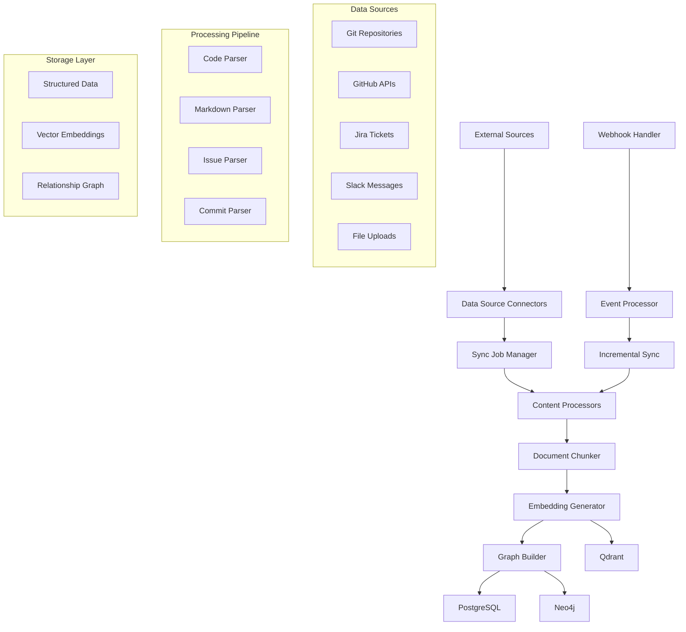

# Ingestion Pipeline

This document describes Hikma's data ingestion pipeline, covering how external data sources are connected, processed, and transformed into searchable knowledge.

## 🎯 Overview

The ingestion pipeline is responsible for:
- **Data Source Integration**: Connecting to Git, GitHub, Jira, Slack, and other external systems
- **Content Processing**: Parsing, chunking, and enriching raw content
- **Multi-Store Distribution**: Storing processed data across PostgreSQL, Qdrant, and Neo4j
- **Real-time Updates**: Handling webhooks and incremental synchronization

## 🏗️ Pipeline Architecture



## 🔌 Data Source Connectors

### 1. Git Connector

**Repository Synchronization**:
```typescript
class GitConnector extends BaseConnector {
  async syncRepository(config: GitConfig): Promise<SyncResult> {
    const { url, branch, authToken, includePatterns, excludePatterns } = config;
    
    // Clone or update repository
    const repoPath = await this.ensureRepository(url, authToken);
    
    // Get changes since last sync
    const lastSyncCommit = await this.getLastSyncCommit(config.dataSourceId);
    const changes = await this.getChangesSince(repoPath, lastSyncCommit);
    
    const results: ProcessedFile[] = [];
    
    for (const change of changes) {
      if (this.shouldProcessFile(change.path, includePatterns, excludePatterns)) {
        const content = await fs.readFile(path.join(repoPath, change.path), 'utf-8');
        const processed = await this.processFile(change.path, content, change);
        results.push(processed);
      }
    }
    
    return {
      processedFiles: results.length,
      totalChanges: changes.length,
      lastCommit: changes[changes.length - 1]?.sha
    };
  }

  private async getChangesSince(repoPath: string, lastCommit?: string): Promise<GitChange[]> {
    const git = simpleGit(repoPath);
    
    const logOptions = lastCommit 
      ? { from: lastCommit, to: 'HEAD' }
      : { maxCount: 100 }; // Initial sync limit
    
    const log = await git.log(logOptions);
    const changes: GitChange[] = [];
    
    for (const commit of log.all) {
      const diff = await git.show([commit.hash, '--name-status']);
      const fileChanges = this.parseDiffOutput(diff);
      
      changes.push(...fileChanges.map(change => ({
        ...change,
        commit: commit.hash,
        author: commit.author_name,
        date: new Date(commit.date),
        message: commit.message
      })));
    }
    
    return changes;
  }
}
```

### 2. GitHub API Connector

**Pull Request and Issue Processing**:
```typescript
class GitHubConnector extends BaseConnector {
  private octokit: Octokit;

  async syncPullRequests(config: GitHubConfig): Promise<SyncResult> {
    const { owner, repo, since } = config;
    
    const pullRequests = await this.octokit.paginate(
      this.octokit.rest.pulls.list,
      {
        owner,
        repo,
        state: 'all',
        sort: 'updated',
        direction: 'desc',
        since: since?.toISOString()
      }
    );

    const results: ProcessedPR[] = [];
    
    for (const pr of pullRequests) {
      // Get PR details including files changed
      const prDetails = await this.octokit.rest.pulls.get({
        owner,
        repo,
        pull_number: pr.number
      });
      
      // Get PR files
      const files = await this.octokit.paginate(
        this.octokit.rest.pulls.listFiles,
        { owner, repo, pull_number: pr.number }
      );
      
      // Get PR reviews and comments
      const [reviews, comments] = await Promise.all([
        this.octokit.paginate(this.octokit.rest.pulls.listReviews, {
          owner, repo, pull_number: pr.number
        }),
        this.octokit.paginate(this.octokit.rest.pulls.listReviewComments, {
          owner, repo, pull_number: pr.number
        })
      ]);
      
      const processed = await this.processPullRequest(prDetails.data, files, reviews, comments);
      results.push(processed);
    }
    
    return { processedPRs: results.length };
  }

  private async processPullRequest(
    pr: PullRequest,
    files: PullRequestFile[],
    reviews: Review[],
    comments: ReviewComment[]
  ): Promise<ProcessedPR> {
    return {
      id: `pr_${pr.id}`,
      number: pr.number,
      title: pr.title,
      description: pr.body || '',
      author: pr.user.login,
      state: pr.state,
      createdAt: new Date(pr.created_at),
      updatedAt: new Date(pr.updated_at),
      mergedAt: pr.merged_at ? new Date(pr.merged_at) : null,
      filesChanged: files.map(f => ({
        filename: f.filename,
        status: f.status,
        additions: f.additions,
        deletions: f.deletions,
        patch: f.patch
      })),
      reviews: reviews.map(r => ({
        author: r.user.login,
        state: r.state,
        body: r.body,
        submittedAt: new Date(r.submitted_at)
      })),
      comments: comments.map(c => ({
        author: c.user.login,
        body: c.body,
        path: c.path,
        line: c.line,
        createdAt: new Date(c.created_at)
      }))
    };
  }
}
```

## ⚙️ Content Processing

### 1. Document Processors

**Code File Processing**:
```typescript
class CodeFileProcessor implements DocumentProcessor {
  async process(filePath: string, content: string, metadata: FileMetadata): Promise<ProcessedDocument> {
    const language = this.detectLanguage(filePath);
    const ast = await this.parseToAST(content, language);
    
    // Extract code entities
    const entities = {
      functions: this.extractFunctions(ast),
      classes: this.extractClasses(ast),
      interfaces: this.extractInterfaces(ast),
      imports: this.extractImports(ast),
      exports: this.extractExports(ast)
    };
    
    // Calculate complexity metrics
    const complexity = this.calculateComplexity(ast);
    
    // Generate documentation
    const documentation = this.extractDocumentation(ast);
    
    return {
      id: this.generateDocumentId(filePath, metadata),
      title: path.basename(filePath),
      content: this.enrichContent(content, entities),
      summary: this.generateSummary(content, entities),
      type: 'CODE_FILE',
      metadata: {
        filePath,
        language,
        size: content.length,
        linesOfCode: content.split('\n').length,
        complexity,
        entities,
        documentation,
        ...metadata
      }
    };
  }

  private enrichContent(content: string, entities: CodeEntities): string {
    // Add semantic markers for better embedding
    const enriched = [
      `File: ${entities.filePath}`,
      `Language: ${entities.language}`,
      entities.functions.length > 0 && `Functions: ${entities.functions.map(f => f.name).join(', ')}`,
      entities.classes.length > 0 && `Classes: ${entities.classes.map(c => c.name).join(', ')}`,
      entities.imports.length > 0 && `Imports: ${entities.imports.join(', ')}`,
      '',
      content
    ].filter(Boolean).join('\n');
    
    return enriched;
  }
}
```

### 2. Document Chunking

**Intelligent Content Chunking**:
```typescript
class DocumentChunker {
  private chunkingStrategies = new Map<DocumentType, ChunkingStrategy>([
    ['CODE_FILE', new CodeAwareChunking()],
    ['MARKDOWN', new MarkdownChunking()],
    ['PULL_REQUEST', new PRChunking()],
    ['ISSUE', new IssueChunking()]
  ]);

  async chunkDocument(document: ProcessedDocument): Promise<DocumentChunk[]> {
    const strategy = this.chunkingStrategies.get(document.type) || new DefaultChunking();
    return strategy.chunk(document);
  }
}

class CodeAwareChunking implements ChunkingStrategy {
  async chunk(document: ProcessedDocument): Promise<DocumentChunk[]> {
    const { content, metadata } = document;
    const chunks: DocumentChunk[] = [];
    
    // Parse AST to identify semantic boundaries
    const ast = await this.parseCode(content, metadata.language);
    const boundaries = this.identifySemanticBoundaries(ast);
    
    let chunkIndex = 0;
    
    for (const boundary of boundaries) {
      const chunkContent = this.extractBoundaryContent(content, boundary);
      
      if (chunkContent.length > 50) { // Skip very small chunks
        chunks.push({
          id: `${document.id}_chunk_${chunkIndex}`,
          documentId: document.id,
          chunkIndex,
          content: chunkContent,
          metadata: {
            type: boundary.type, // 'function', 'class', 'comment', etc.
            name: boundary.name,
            startLine: boundary.startLine,
            endLine: boundary.endLine,
            complexity: boundary.complexity
          }
        });
        chunkIndex++;
      }
    }
    
    return chunks;
  }

  private identifySemanticBoundaries(ast: AST): SemanticBoundary[] {
    const boundaries: SemanticBoundary[] = [];
    
    // Extract functions as boundaries
    for (const func of ast.functions) {
      boundaries.push({
        type: 'function',
        name: func.name,
        startLine: func.startLine,
        endLine: func.endLine,
        complexity: this.calculateFunctionComplexity(func)
      });
    }
    
    // Extract classes as boundaries
    for (const cls of ast.classes) {
      boundaries.push({
        type: 'class',
        name: cls.name,
        startLine: cls.startLine,
        endLine: cls.endLine,
        complexity: this.calculateClassComplexity(cls)
      });
    }
    
    return boundaries.sort((a, b) => a.startLine - b.startLine);
  }
}
```

## 🔄 Sync Job Management

### 1. Job Scheduling

**Sync Job Orchestration**:
```typescript
class SyncJobManager {
  private jobQueue = new Queue<SyncJob>('sync-jobs', {
    redis: RedisManager.getInstance().getClient(),
    defaultJobOptions: {
      removeOnComplete: 100,
      removeOnFail: 50,
      attempts: 3,
      backoff: 'exponential'
    }
  });

  async scheduleSyncJob(dataSource: DataSource, type: SyncJobType): Promise<string> {
    const job = await this.jobQueue.add('sync', {
      id: generateId(),
      projectId: dataSource.projectId,
      dataSourceId: dataSource.id,
      type,
      config: dataSource.config,
      createdAt: new Date()
    }, {
      priority: this.getJobPriority(type),
      delay: this.getJobDelay(type)
    });

    // Update database
    await this.database.syncJob.create({
      data: {
        id: job.id as string,
        projectId: dataSource.projectId,
        dataSourceId: dataSource.id,
        type,
        status: 'PENDING'
      }
    });

    return job.id as string;
  }

  private setupJobProcessors(): void {
    this.jobQueue.process('sync', 5, async (job) => {
      const { dataSourceId, type, config } = job.data;
      
      try {
        await this.updateJobStatus(job.id as string, 'RUNNING');
        
        const connector = this.getConnector(config.type);
        const result = await connector.sync(config);
        
        await this.updateJobStatus(job.id as string, 'COMPLETED', {
          processedItems: result.processedItems,
          totalItems: result.totalItems
        });
        
        return result;
      } catch (error) {
        await this.updateJobStatus(job.id as string, 'FAILED', {
          error: error.message
        });
        throw error;
      }
    });
  }
}
```

### 2. Error Handling and Recovery

**Robust Error Management**:
```typescript
class SyncErrorHandler {
  async handleSyncError(
    jobId: string,
    error: Error,
    context: SyncContext
  ): Promise<void> {
    const errorInfo = {
      jobId,
      error: error.message,
      stack: error.stack,
      context,
      timestamp: new Date()
    };

    // Log error with context
    logger.error('Sync job failed', errorInfo);

    // Update job status
    await this.database.syncJob.update({
      where: { id: jobId },
      data: {
        status: 'FAILED',
        errorCount: { increment: 1 },
        errors: {
          push: errorInfo
        }
      }
    });

    // Determine if retry is appropriate
    const job = await this.database.syncJob.findUnique({
      where: { id: jobId }
    });

    if (job && this.shouldRetry(job, error)) {
      await this.scheduleRetry(job, error);
    } else {
      await this.handleFinalFailure(job, error);
    }
  }

  private shouldRetry(job: SyncJob, error: Error): boolean {
    // Don't retry if too many attempts
    if (job.errorCount >= 3) return false;
    
    // Don't retry authentication errors
    if (error.message.includes('authentication') || error.message.includes('unauthorized')) {
      return false;
    }
    
    // Don't retry if data source is disabled
    if (job.dataSource.status === 'DISABLED') return false;
    
    // Retry for network errors, rate limits, etc.
    return true;
  }

  private async scheduleRetry(job: SyncJob, error: Error): Promise<void> {
    const delay = this.calculateRetryDelay(job.errorCount);
    
    await this.syncJobManager.scheduleSyncJob(
      job.dataSource,
      job.type,
      { delay }
    );
  }
}
```

## 📊 Pipeline Monitoring

### 1. Performance Metrics

**Ingestion Performance Tracking**:
```typescript
class IngestionMetrics {
  async recordSyncMetrics(jobId: string, metrics: SyncMetrics): Promise<void> {
    await this.database.metric.createMany({
      data: [
        {
          name: 'sync_duration',
          value: metrics.duration,
          labels: { jobId, dataSourceType: metrics.dataSourceType }
        },
        {
          name: 'documents_processed',
          value: metrics.documentsProcessed,
          labels: { jobId, dataSourceType: metrics.dataSourceType }
        },
        {
          name: 'processing_rate',
          value: metrics.documentsProcessed / (metrics.duration / 1000),
          labels: { jobId, dataSourceType: metrics.dataSourceType }
        }
      ]
    });
  }

  async getIngestionHealth(): Promise<IngestionHealth> {
    const recentJobs = await this.database.syncJob.findMany({
      where: {
        createdAt: { gte: new Date(Date.now() - 24 * 60 * 60 * 1000) }
      },
      include: { dataSource: true }
    });

    const successRate = recentJobs.filter(j => j.status === 'COMPLETED').length / recentJobs.length;
    const avgDuration = recentJobs.reduce((sum, job) => sum + (job.duration || 0), 0) / recentJobs.length;

    return {
      successRate,
      avgDuration,
      totalJobs: recentJobs.length,
      failedJobs: recentJobs.filter(j => j.status === 'FAILED').length
    };
  }
}
```

This ingestion pipeline ensures reliable, scalable data processing while maintaining data quality and providing comprehensive monitoring capabilities.