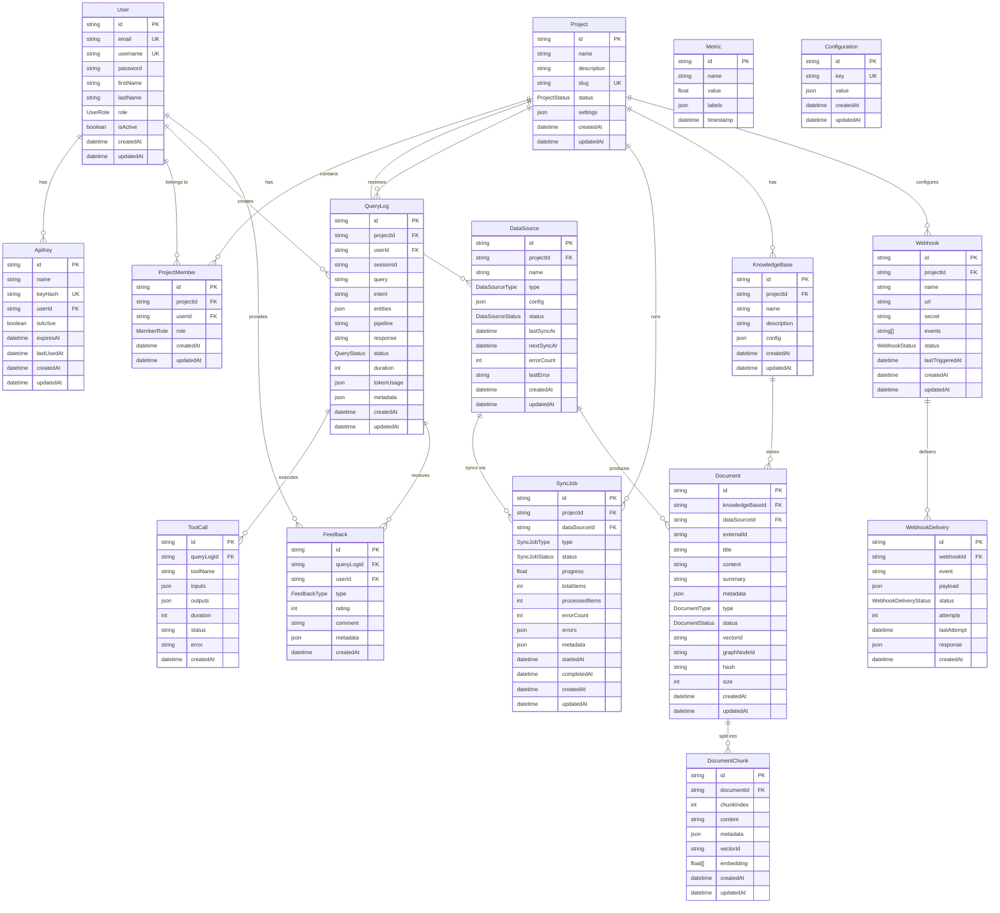

# Hikma Database Schema

This document contains the database schema diagram for the Hikma platform, generated from the Prisma schema file.

## Entity Relationship Diagram

## Key Features

### Multi-Database Architecture
The Hikma platform uses a hybrid database approach:
- **PostgreSQL**: Primary relational data (shown in this diagram)
- **Redis**: Caching and session storage
- **Neo4j**: Relationship graphs between entities
- **Pinecone**: Vector embeddings for semantic search

### Core Entity Groups

1. **User Management**: Users, API keys, and authentication
2. **Project Management**: Projects, members, and permissions
3. **Data Ingestion**: Data sources and synchronization jobs
4. **Knowledge Base**: Documents, chunks, and content storage
5. **Query Processing**: Query logs, tool calls, and responses
6. **Feedback System**: User feedback and ratings
7. **System Management**: Metrics, configuration, and webhooks

### Key Relationships

- **Users** can be members of multiple **Projects** with different roles
- **Projects** can have multiple **Data Sources** (Git, GitHub, Jira, etc.)
- **Data Sources** are synchronized via **Sync Jobs** to produce **Documents**
- **Documents** are stored in **Knowledge Bases** and split into **Document Chunks**
- **Query Logs** track user interactions and can execute **Tool Calls**
- **Webhooks** enable real-time integrations with external systems

### Enums and Status Types

The schema includes several enums for type safety:
- `UserRole`: ADMIN, USER, VIEWER
- `ProjectStatus`: ACTIVE, INACTIVE, ARCHIVED
- `DataSourceType`: GIT, GITHUB, JIRA, SLACK, CONFLUENCE, FILE_UPLOAD
- `DocumentType`: CODE_FILE, COMMIT, PULL_REQUEST, ISSUE, etc.
- `QueryStatus`: PENDING, PROCESSING, COMPLETED, FAILED, CANCELLED

This design supports the platform's goal of providing intelligent code analysis and workflow integration across multiple data sources.