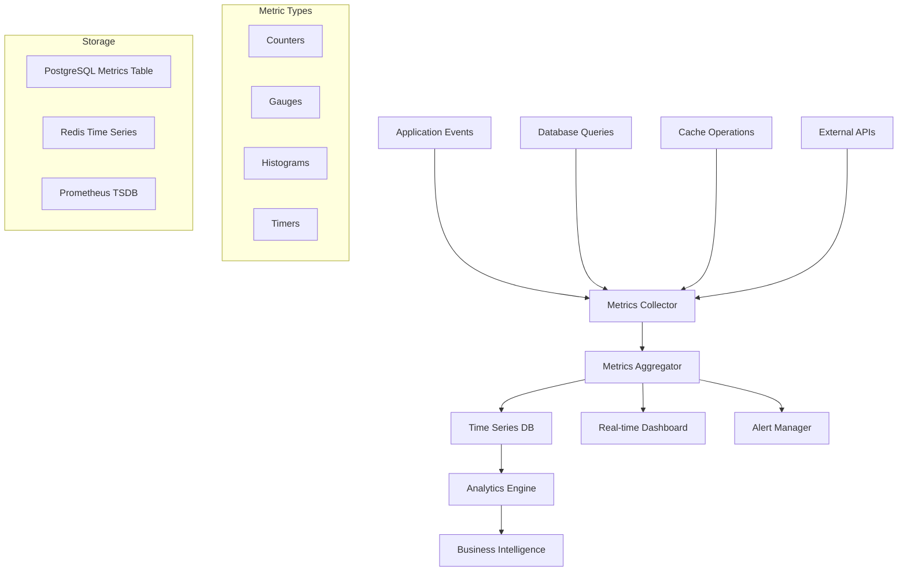

# Metrics Collection

This document describes Hikma's comprehensive metrics collection system, covering performance monitoring, usage analytics, and business intelligence.

## 🎯 Overview

Hikma collects metrics across multiple dimensions:
- **Performance Metrics**: Response times, throughput, error rates
- **Usage Analytics**: User behavior, query patterns, feature adoption
- **Business Metrics**: User engagement, project growth, system health
- **Technical Metrics**: Database performance, cache hit rates, resource utilization

## 📊 Metrics Architecture



## 🔢 Metric Types and Collection

### 1. Performance Metrics

**Query Performance Tracking**:
```typescript
class QueryMetricsCollector {
  async recordQueryMetrics(queryData: QueryMetrics): Promise<void> {
    const metrics = [
      {
        name: 'query_duration',
        value: queryData.duration,
        labels: {
          project_id: queryData.projectId,
          user_id: queryData.userId,
          intent: queryData.intent,
          pipeline: queryData.pipeline
        },
        timestamp: new Date()
      },
      {
        name: 'query_tokens_used',
        value: queryData.tokenUsage.total,
        labels: {
          project_id: queryData.projectId,
          model: queryData.tokenUsage.model
        },
        timestamp: new Date()
      },
      {
        name: 'query_success_rate',
        value: queryData.success ? 1 : 0,
        labels: {
          project_id: queryData.projectId,
          error_type: queryData.errorType
        },
        timestamp: new Date()
      }
    ];

    await this.batchInsertMetrics(metrics);
  }

  async recordToolCallMetrics(toolCall: ToolCallMetrics): Promise<void> {
    await this.insertMetric({
      name: 'tool_call_duration',
      value: toolCall.duration,
      labels: {
        tool_name: toolCall.toolName,
        status: toolCall.status,
        project_id: toolCall.projectId
      }
    });
  }
}
```

**Database Performance Monitoring**:
```typescript
class DatabaseMetricsCollector {
  private prisma: PrismaClient;

  async collectDatabaseMetrics(): Promise<void> {
    // Query execution metrics
    const slowQueries = await this.getSlowQueries();
    for (const query of slowQueries) {
      await this.recordMetric({
        name: 'db_slow_query',
        value: query.duration,
        labels: {
          query_type: query.type,
          table: query.table
        }
      });
    }

    // Connection pool metrics
    const poolStats = await this.getConnectionPoolStats();
    await this.recordMetric({
      name: 'db_connections_active',
      value: poolStats.active,
      labels: { pool: 'main' }
    });

    await this.recordMetric({
      name: 'db_connections_idle',
      value: poolStats.idle,
      labels: { pool: 'main' }
    });

    // Table size metrics
    const tableSizes = await this.getTableSizes();
    for (const [table, size] of Object.entries(tableSizes)) {
      await this.recordMetric({
        name: 'db_table_size_bytes',
        value: size,
        labels: { table }
      });
    }
  }

  private async getSlowQueries(): Promise<SlowQuery[]> {
    // This would integrate with PostgreSQL's pg_stat_statements
    const result = await this.prisma.$queryRaw`
      SELECT 
        query,
        calls,
        total_time,
        mean_time,
        rows
      FROM pg_stat_statements 
      WHERE mean_time > 1000 
      ORDER BY total_time DESC 
      LIMIT 10
    `;
    
    return result as SlowQuery[];
  }
}
```

### 2. Usage Analytics

**User Behavior Tracking**:
```typescript
class UserAnalyticsCollector {
  async trackUserAction(action: UserAction): Promise<void> {
    const metrics = [
      {
        name: 'user_action',
        value: 1,
        labels: {
          user_id: action.userId,
          action_type: action.type,
          project_id: action.projectId,
          source: action.source // 'web', 'api', 'slack', etc.
        }
      }
    ];

    // Track session duration
    if (action.type === 'session_end') {
      metrics.push({
        name: 'session_duration',
        value: action.sessionDuration,
        labels: {
          user_id: action.userId,
          project_id: action.projectId
        }
      });
    }

    // Track feature usage
    if (action.feature) {
      metrics.push({
        name: 'feature_usage',
        value: 1,
        labels: {
          feature: action.feature,
          user_id: action.userId,
          project_id: action.projectId
        }
      });
    }

    await this.batchInsertMetrics(metrics);
  }

  async trackQueryPattern(query: string, userId: string, projectId: string): Promise<void> {
    // Extract query characteristics
    const characteristics = this.analyzeQuery(query);
    
    await this.recordMetric({
      name: 'query_pattern',
      value: 1,
      labels: {
        user_id: userId,
        project_id: projectId,
        query_length: this.categorizeLength(query.length),
        has_code_terms: characteristics.hasCodeTerms ? 'true' : 'false',
        complexity: characteristics.complexity,
        intent_category: characteristics.intentCategory
      }
    });
  }

  private analyzeQuery(query: string): QueryCharacteristics {
    const codeTerms = ['function', 'class', 'method', 'variable', 'import', 'export'];
    const hasCodeTerms = codeTerms.some(term => query.toLowerCase().includes(term));
    
    return {
      hasCodeTerms,
      complexity: this.calculateQueryComplexity(query),
      intentCategory: this.classifyIntent(query)
    };
  }
}
```

**Project Analytics**:
```typescript
class ProjectAnalyticsCollector {
  async collectProjectMetrics(projectId: string): Promise<void> {
    const project = await this.getProject(projectId);
    
    // Document metrics
    const documentStats = await this.getDocumentStats(projectId);
    await this.recordMetric({
      name: 'project_documents_total',
      value: documentStats.total,
      labels: { project_id: projectId }
    });

    await this.recordMetric({
      name: 'project_documents_by_type',
      value: documentStats.codeFiles,
      labels: { project_id: projectId, type: 'code' }
    });

    // User engagement metrics
    const engagementStats = await this.getUserEngagementStats(projectId);
    await this.recordMetric({
      name: 'project_active_users',
      value: engagementStats.activeUsers,
      labels: { project_id: projectId, period: 'daily' }
    });

    await this.recordMetric({
      name: 'project_queries_per_day',
      value: engagementStats.queriesPerDay,
      labels: { project_id: projectId }
    });

    // Sync health metrics
    const syncStats = await this.getSyncStats(projectId);
    await this.recordMetric({
      name: 'project_sync_success_rate',
      value: syncStats.successRate,
      labels: { project_id: projectId }
    });
  }

  async trackProjectGrowth(): Promise<void> {
    const projects = await this.getAllProjects();
    
    for (const project of projects) {
      const growth = await this.calculateProjectGrowth(project.id);
      
      await this.recordMetric({
        name: 'project_growth_rate',
        value: growth.documentGrowthRate,
        labels: { 
          project_id: project.id,
          metric: 'documents',
          period: 'weekly'
        }
      });

      await this.recordMetric({
        name: 'project_growth_rate',
        value: growth.userGrowthRate,
        labels: { 
          project_id: project.id,
          metric: 'users',
          period: 'weekly'
        }
      });
    }
  }
}
```

### 3. System Health Metrics

**Infrastructure Monitoring**:
```typescript
class SystemHealthCollector {
  async collectSystemMetrics(): Promise<void> {
    // Memory usage
    const memUsage = process.memoryUsage();
    await this.recordMetric({
      name: 'nodejs_memory_usage_bytes',
      value: memUsage.heapUsed,
      labels: { type: 'heap_used' }
    });

    await this.recordMetric({
      name: 'nodejs_memory_usage_bytes',
      value: memUsage.rss,
      labels: { type: 'rss' }
    });

    // CPU usage
    const cpuUsage = process.cpuUsage();
    await this.recordMetric({
      name: 'nodejs_cpu_usage_microseconds',
      value: cpuUsage.user,
      labels: { type: 'user' }
    });

    // Event loop lag
    const eventLoopLag = await this.measureEventLoopLag();
    await this.recordMetric({
      name: 'nodejs_eventloop_lag_seconds',
      value: eventLoopLag / 1000
    });

    // External service health
    await this.checkExternalServices();
  }

  private async checkExternalServices(): Promise<void> {
    const services = [
      { name: 'postgresql', check: () => this.checkPostgreSQL() },
      { name: 'redis', check: () => this.checkRedis() },
      { name: 'qdrant', check: () => this.checkQdrant() },
      { name: 'neo4j', check: () => this.checkNeo4j() },
      { name: 'openai', check: () => this.checkOpenAI() }
    ];

    for (const service of services) {
      try {
        const startTime = Date.now();
        const isHealthy = await service.check();
        const responseTime = Date.now() - startTime;

        await this.recordMetric({
          name: 'service_health',
          value: isHealthy ? 1 : 0,
          labels: { service: service.name }
        });

        await this.recordMetric({
          name: 'service_response_time',
          value: responseTime,
          labels: { service: service.name }
        });
      } catch (error) {
        await this.recordMetric({
          name: 'service_health',
          value: 0,
          labels: { service: service.name }
        });
      }
    }
  }
}
```

## 📈 Real-time Analytics

### 1. Live Dashboard Metrics

**Real-time Metrics Streaming**:
```typescript
class RealTimeMetricsService {
  private websocketServer: WebSocketServer;
  private metricsBuffer = new Map<string, MetricPoint[]>();

  constructor() {
    this.setupWebSocketServer();
    this.startMetricsStreaming();
  }

  async streamMetrics(clientId: string, subscriptions: string[]): Promise<void> {
    const client = this.websocketServer.clients.get(clientId);
    if (!client) return;

    // Send current metrics
    for (const metricName of subscriptions) {
      const recentMetrics = await this.getRecentMetrics(metricName, 100);
      client.send(JSON.stringify({
        type: 'metrics_data',
        metric: metricName,
        data: recentMetrics
      }));
    }

    // Subscribe to updates
    this.subscribeToMetricUpdates(clientId, subscriptions);
  }

  private startMetricsStreaming(): void {
    setInterval(async () => {
      const liveMetrics = await this.collectLiveMetrics();
      
      for (const [metricName, value] of Object.entries(liveMetrics)) {
        this.broadcastMetricUpdate(metricName, value);
      }
    }, 5000); // Update every 5 seconds
  }

  private async collectLiveMetrics(): Promise<Record<string, number>> {
    return {
      active_users: await this.countActiveUsers(),
      queries_per_minute: await this.getQueriesPerMinute(),
      avg_response_time: await this.getAverageResponseTime(),
      cache_hit_rate: await this.getCacheHitRate(),
      error_rate: await this.getErrorRate()
    };
  }
}
```

### 2. Alerting System

**Metric-based Alerting**:
```typescript
class MetricsAlertManager {
  private alertRules: AlertRule[] = [
    {
      name: 'high_error_rate',
      metric: 'error_rate',
      condition: 'greater_than',
      threshold: 0.05, // 5%
      duration: 300, // 5 minutes
      severity: 'critical'
    },
    {
      name: 'slow_queries',
      metric: 'avg_query_duration',
      condition: 'greater_than',
      threshold: 5000, // 5 seconds
      duration: 600, // 10 minutes
      severity: 'warning'
    },
    {
      name: 'low_cache_hit_rate',
      metric: 'cache_hit_rate',
      condition: 'less_than',
      threshold: 0.7, // 70%
      duration: 900, // 15 minutes
      severity: 'warning'
    }
  ];

  async evaluateAlerts(): Promise<void> {
    for (const rule of this.alertRules) {
      const isTriggered = await this.evaluateRule(rule);
      
      if (isTriggered) {
        await this.triggerAlert(rule);
      } else {
        await this.resolveAlert(rule);
      }
    }
  }

  private async evaluateRule(rule: AlertRule): Promise<boolean> {
    const recentMetrics = await this.getRecentMetrics(
      rule.metric,
      rule.duration
    );

    if (recentMetrics.length === 0) return false;

    const avgValue = recentMetrics.reduce((sum, m) => sum + m.value, 0) / recentMetrics.length;

    switch (rule.condition) {
      case 'greater_than':
        return avgValue > rule.threshold;
      case 'less_than':
        return avgValue < rule.threshold;
      case 'equals':
        return avgValue === rule.threshold;
      default:
        return false;
    }
  }

  private async triggerAlert(rule: AlertRule): Promise<void> {
    const existingAlert = await this.getActiveAlert(rule.name);
    if (existingAlert) return; // Already triggered

    const alert = {
      id: generateId(),
      rule: rule.name,
      severity: rule.severity,
      message: this.generateAlertMessage(rule),
      triggeredAt: new Date(),
      status: 'active'
    };

    await this.saveAlert(alert);
    await this.sendAlertNotification(alert);
  }
}
```

## 📊 Business Intelligence

### 1. Usage Analytics Dashboard

**User Engagement Metrics**:
```typescript
class BusinessIntelligenceService {
  async generateUsageReport(projectId: string, period: TimePeriod): Promise<UsageReport> {
    const [userMetrics, queryMetrics, featureMetrics] = await Promise.all([
      this.getUserMetrics(projectId, period),
      this.getQueryMetrics(projectId, period),
      this.getFeatureMetrics(projectId, period)
    ]);

    return {
      period,
      projectId,
      summary: {
        totalUsers: userMetrics.totalUsers,
        activeUsers: userMetrics.activeUsers,
        totalQueries: queryMetrics.totalQueries,
        avgQueriesPerUser: queryMetrics.totalQueries / userMetrics.activeUsers,
        userRetentionRate: userMetrics.retentionRate
      },
      userEngagement: {
        dailyActiveUsers: userMetrics.dailyActiveUsers,
        sessionDuration: userMetrics.avgSessionDuration,
        queriesPerSession: userMetrics.avgQueriesPerSession
      },
      queryAnalytics: {
        queryTypes: queryMetrics.queryTypes,
        successRate: queryMetrics.successRate,
        avgResponseTime: queryMetrics.avgResponseTime,
        popularTopics: queryMetrics.popularTopics
      },
      featureAdoption: {
        mostUsedFeatures: featureMetrics.mostUsed,
        featureGrowth: featureMetrics.growth,
        userSegmentation: featureMetrics.userSegmentation
      }
    };
  }

  async generatePerformanceReport(): Promise<PerformanceReport> {
    const metrics = await this.getPerformanceMetrics();
    
    return {
      systemHealth: {
        uptime: metrics.uptime,
        errorRate: metrics.errorRate,
        avgResponseTime: metrics.avgResponseTime
      },
      resourceUtilization: {
        cpuUsage: metrics.cpuUsage,
        memoryUsage: metrics.memoryUsage,
        diskUsage: metrics.diskUsage
      },
      databasePerformance: {
        queryPerformance: metrics.dbQueryPerformance,
        connectionPoolHealth: metrics.connectionPoolHealth,
        slowQueries: metrics.slowQueries
      },
      cachePerformance: {
        hitRate: metrics.cacheHitRate,
        evictionRate: metrics.cacheEvictionRate,
        memoryUsage: metrics.cacheMemoryUsage
      }
    };
  }
}
```

### 2. Predictive Analytics

**Trend Analysis and Forecasting**:
```typescript
class PredictiveAnalyticsService {
  async predictUserGrowth(projectId: string): Promise<GrowthPrediction> {
    const historicalData = await this.getUserGrowthHistory(projectId);
    
    // Simple linear regression for demonstration
    const prediction = this.linearRegression(historicalData);
    
    return {
      currentUsers: historicalData[historicalData.length - 1].value,
      predictedGrowth: {
        nextMonth: prediction.predict(30),
        nextQuarter: prediction.predict(90),
        nextYear: prediction.predict(365)
      },
      confidence: prediction.rSquared,
      trend: prediction.slope > 0 ? 'growing' : 'declining'
    };
  }

  async identifyUsagePatterns(projectId: string): Promise<UsagePattern[]> {
    const queryData = await this.getQueryPatterns(projectId);
    
    // Cluster analysis to identify usage patterns
    const patterns = this.clusterAnalysis(queryData);
    
    return patterns.map(pattern => ({
      id: pattern.id,
      name: pattern.name,
      description: pattern.description,
      userCount: pattern.userCount,
      queryCharacteristics: pattern.characteristics,
      timePatterns: pattern.timePatterns,
      recommendations: this.generateRecommendations(pattern)
    }));
  }

  private generateRecommendations(pattern: UsagePattern): string[] {
    const recommendations: string[] = [];
    
    if (pattern.characteristics.avgResponseTime > 3000) {
      recommendations.push('Consider optimizing search performance for this user segment');
    }
    
    if (pattern.characteristics.errorRate > 0.1) {
      recommendations.push('Improve error handling for common query types');
    }
    
    if (pattern.timePatterns.peakHours.length > 0) {
      recommendations.push(`Scale resources during peak hours: ${pattern.timePatterns.peakHours.join(', ')}`);
    }
    
    return recommendations;
  }
}
```

This comprehensive metrics collection system provides Hikma with deep insights into system performance, user behavior, and business growth while enabling proactive monitoring and optimization.