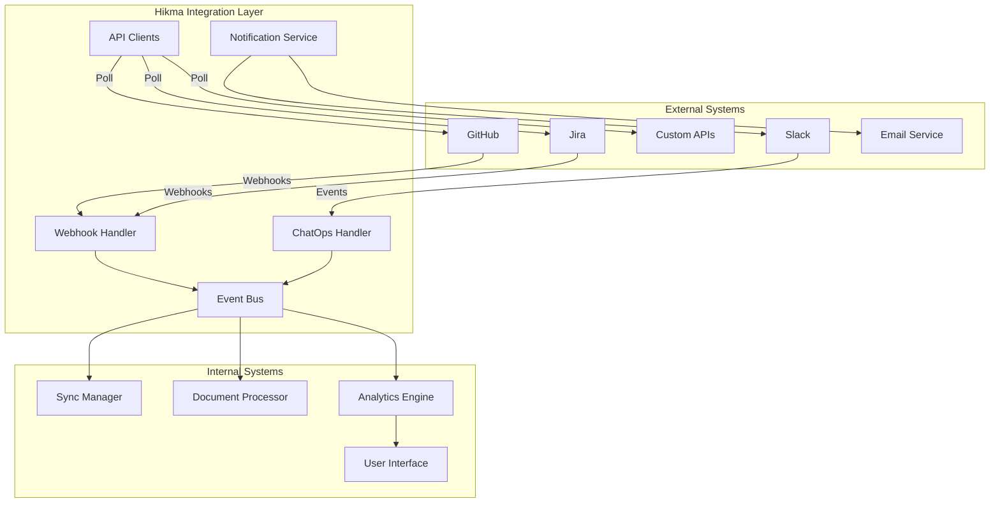

# System Integration Patterns

This document describes Hikma's integration patterns with external systems, covering webhooks, API integrations, and real-time event processing.

## 🎯 Overview

Hikma integrates with external systems through multiple patterns:
- **Webhook Integration**: Real-time event processing from GitHub, Jira, Slack
- **API Polling**: Scheduled data synchronization with external APIs
- **ChatOps Integration**: Slack/Teams bot interactions
- **Notification Systems**: Email, Slack, and webhook notifications

## 🔗 Integration Architecture



## 🪝 Webhook Integration

### 1. GitHub Webhook Handler

**GitHub Event Processing**:
```typescript
class GitHubWebhookHandler {
  async handleWebhook(
    event: string,
    payload: GitHubWebhookPayload,
    signature: string
  ): Promise<void> {
    // Verify webhook signature
    if (!this.verifySignature(payload, signature)) {
      throw new Error('Invalid webhook signature');
    }

    // Log webhook delivery
    await this.logWebhookDelivery(event, payload);

    // Route to appropriate handler
    switch (event) {
      case 'push':
        await this.handlePushEvent(payload as PushPayload);
        break;
      case 'pull_request':
        await this.handlePullRequestEvent(payload as PullRequestPayload);
        break;
      case 'issues':
        await this.handleIssueEvent(payload as IssuePayload);
        break;
      case 'pull_request_review':
        await this.handleReviewEvent(payload as ReviewPayload);
        break;
      default:
        logger.info(`Unhandled GitHub event: ${event}`);
    }
  }

  private async handlePushEvent(payload: PushPayload): Promise<void> {
    const { repository, commits, ref } = payload;
    
    // Find matching data source
    const dataSource = await this.findDataSource(repository.clone_url);
    if (!dataSource) return;

    // Extract changed files
    const changedFiles = commits.flatMap(commit => [
      ...commit.added,
      ...commit.modified,
      ...commit.removed
    ]);

    // Schedule incremental sync
    await this.syncManager.scheduleIncrementalSync(dataSource.id, {
      type: 'push',
      commits: commits.map(c => c.id),
      changedFiles,
      branch: ref.replace('refs/heads/', '')
    });

    // Publish event for real-time updates
    await this.eventBus.publish('code.updated', {
      projectId: dataSource.projectId,
      dataSourceId: dataSource.id,
      changedFiles,
      commits: commits.length
    });
  }

  private async handlePullRequestEvent(payload: PullRequestPayload): Promise<void> {
    const { action, pull_request, repository } = payload;
    
    const dataSource = await this.findDataSource(repository.clone_url);
    if (!dataSource) return;

    switch (action) {
      case 'opened':
      case 'synchronize':
        await this.processPullRequest(dataSource, pull_request);
        break;
      case 'closed':
        if (pull_request.merged) {
          await this.handlePRMerged(dataSource, pull_request);
        }
        break;
    }
  }

  private verifySignature(payload: any, signature: string): boolean {
    const secret = process.env.GITHUB_WEBHOOK_SECRET;
    const expectedSignature = crypto
      .createHmac('sha256', secret)
      .update(JSON.stringify(payload))
      .digest('hex');
    
    return `sha256=${expectedSignature}` === signature;
  }
}
```

### 2. Jira Webhook Handler

**Jira Issue and Project Events**:
```typescript
class JiraWebhookHandler {
  async handleWebhook(payload: JiraWebhookPayload): Promise<void> {
    const { webhookEvent, issue, project } = payload;

    // Find matching data source
    const dataSource = await this.findJiraDataSource(project.key);
    if (!dataSource) return;

    switch (webhookEvent) {
      case 'jira:issue_created':
      case 'jira:issue_updated':
        await this.processIssueUpdate(dataSource, issue);
        break;
      case 'jira:issue_deleted':
        await this.handleIssueDeletion(dataSource, issue);
        break;
      case 'comment_created':
      case 'comment_updated':
        await this.processCommentUpdate(dataSource, payload.comment, issue);
        break;
    }
  }

  private async processIssueUpdate(
    dataSource: DataSource,
    issue: JiraIssue
  ): Promise<void> {
    // Process issue content
    const processedIssue = await this.processJiraIssue(issue);
    
    // Update document in knowledge base
    await this.documentService.upsertDocument({
      id: `jira_${issue.key}`,
      knowledgeBaseId: dataSource.knowledgeBaseId,
      dataSourceId: dataSource.id,
      externalId: issue.key,
      title: issue.fields.summary,
      content: this.buildIssueContent(issue),
      type: 'JIRA_TICKET',
      metadata: {
        issueType: issue.fields.issuetype.name,
        status: issue.fields.status.name,
        priority: issue.fields.priority?.name,
        assignee: issue.fields.assignee?.displayName,
        reporter: issue.fields.reporter.displayName,
        labels: issue.fields.labels,
        components: issue.fields.components?.map(c => c.name),
        fixVersions: issue.fields.fixVersions?.map(v => v.name)
      }
    });

    // Publish event
    await this.eventBus.publish('issue.updated', {
      projectId: dataSource.projectId,
      issueKey: issue.key,
      action: 'updated'
    });
  }
}
```

## 🤖 ChatOps Integration

### 1. Slack Bot Integration

**Slack Command Handling**:
```typescript
class SlackBotHandler {
  private app: App;

  constructor() {
    this.app = new App({
      token: process.env.SLACK_BOT_TOKEN,
      signingSecret: process.env.SLACK_SIGNING_SECRET,
      appToken: process.env.SLACK_APP_TOKEN,
      socketMode: true
    });

    this.setupCommands();
    this.setupEvents();
  }

  private setupCommands(): void {
    // /hikma query command
    this.app.command('/hikma', async ({ command, ack, respond, client }) => {
      await ack();

      const { text, user_id, channel_id, team_id } = command;
      
      try {
        // Parse command
        const [action, ...args] = text.split(' ');
        
        switch (action) {
          case 'query':
            await this.handleQueryCommand(args.join(' '), user_id, respond);
            break;
          case 'status':
            await this.handleStatusCommand(user_id, respond);
            break;
          case 'help':
            await this.handleHelpCommand(respond);
            break;
          default:
            await respond({
              text: `Unknown command: ${action}. Type \`/hikma help\` for available commands.`,
              response_type: 'ephemeral'
            });
        }
      } catch (error) {
        await respond({
          text: `Error processing command: ${error.message}`,
          response_type: 'ephemeral'
        });
      }
    });

    // Interactive button handling
    this.app.action('query_feedback', async ({ ack, body, client }) => {
      await ack();
      
      const { user, actions } = body as BlockAction;
      const feedback = actions[0].value;
      
      await this.recordQueryFeedback(user.id, feedback);
      
      await client.chat.update({
        channel: body.channel.id,
        ts: body.message.ts,
        text: 'Thank you for your feedback!',
        blocks: []
      });
    });
  }

  private async handleQueryCommand(
    query: string,
    userId: string,
    respond: RespondFn
  ): Promise<void> {
    if (!query.trim()) {
      await respond({
        text: 'Please provide a query. Example: `/hikma query How does authentication work?`',
        response_type: 'ephemeral'
      });
      return;
    }

    // Get user's project context
    const userProjects = await this.getUserProjects(userId);
    if (userProjects.length === 0) {
      await respond({
        text: 'You don\'t have access to any projects. Please contact your administrator.',
        response_type: 'ephemeral'
      });
      return;
    }

    // Show loading message
    await respond({
      text: '🔍 Searching for answers...',
      response_type: 'ephemeral'
    });

    try {
      // Execute query
      const result = await this.queryService.executeQuery(query, {
        userId,
        projectId: userProjects[0].id, // Use first project for now
        source: 'slack'
      });

      // Format response
      const blocks = this.formatQueryResponse(result);
      
      await respond({
        blocks,
        response_type: 'ephemeral'
      });
    } catch (error) {
      await respond({
        text: `Sorry, I encountered an error: ${error.message}`,
        response_type: 'ephemeral'
      });
    }
  }

  private formatQueryResponse(result: QueryResult): Block[] {
    const blocks: Block[] = [
      {
        type: 'section',
        text: {
          type: 'mrkdwn',
          text: `*Query:* ${result.query}`
        }
      },
      {
        type: 'section',
        text: {
          type: 'mrkdwn',
          text: result.response
        }
      }
    ];

    // Add source references if available
    if (result.sources && result.sources.length > 0) {
      blocks.push({
        type: 'section',
        text: {
          type: 'mrkdwn',
          text: '*Sources:*'
        }
      });

      result.sources.slice(0, 3).forEach(source => {
        blocks.push({
          type: 'section',
          text: {
            type: 'mrkdwn',
            text: `• <${source.url}|${source.title}>`
          }
        });
      });
    }

    // Add feedback buttons
    blocks.push({
      type: 'actions',
      elements: [
        {
          type: 'button',
          text: { type: 'plain_text', text: '👍 Helpful' },
          action_id: 'query_feedback',
          value: 'helpful'
        },
        {
          type: 'button',
          text: { type: 'plain_text', text: '👎 Not helpful' },
          action_id: 'query_feedback',
          value: 'not_helpful'
        }
      ]
    });

    return blocks;
  }
}
```

### 2. Teams Integration

**Microsoft Teams Bot**:
```typescript
class TeamsBot {
  private adapter: CloudAdapter;
  private bot: TeamsActivityHandler;

  constructor() {
    this.adapter = new CloudAdapter({
      appId: process.env.TEAMS_APP_ID,
      appPassword: process.env.TEAMS_APP_PASSWORD
    });

    this.bot = new TeamsActivityHandler();
    this.setupHandlers();
  }

  private setupHandlers(): void {
    this.bot.onMessage(async (context, next) => {
      const text = context.activity.text?.trim();
      
      if (text?.startsWith('@hikma')) {
        const query = text.replace('@hikma', '').trim();
        await this.handleQuery(context, query);
      }
      
      await next();
    });

    this.bot.onMembersAdded(async (context, next) => {
      const welcomeText = 'Hello! I\'m Hikma, your AI code intelligence assistant. ' +
                         'Ask me questions about your codebase by mentioning @hikma followed by your question.';
      
      for (const member of context.activity.membersAdded) {
        if (member.id !== context.activity.recipient.id) {
          await context.sendActivity(MessageFactory.text(welcomeText));
        }
      }
      
      await next();
    });
  }

  private async handleQuery(context: TurnContext, query: string): Promise<void> {
    if (!query) {
      await context.sendActivity(MessageFactory.text(
        'Please provide a question. Example: @hikma How does user authentication work?'
      ));
      return;
    }

    // Show typing indicator
    await context.sendActivity({ type: 'typing' });

    try {
      const result = await this.queryService.executeQuery(query, {
        userId: context.activity.from.id,
        source: 'teams'
      });

      const card = this.createAdaptiveCard(result);
      await context.sendActivity(MessageFactory.attachment(card));
    } catch (error) {
      await context.sendActivity(MessageFactory.text(
        `Sorry, I encountered an error: ${error.message}`
      ));
    }
  }
}
```

## 📧 Notification System

### 1. Multi-Channel Notifications

**Notification Service**:
```typescript
class NotificationService {
  private channels = new Map<string, NotificationChannel>([
    ['email', new EmailChannel()],
    ['slack', new SlackChannel()],
    ['webhook', new WebhookChannel()],
    ['in_app', new InAppChannel()]
  ]);

  async sendNotification(notification: Notification): Promise<void> {
    const { recipients, channels, template, data } = notification;

    const deliveryPromises = channels.map(async (channelType) => {
      const channel = this.channels.get(channelType);
      if (!channel) return;

      for (const recipient of recipients) {
        try {
          await channel.send(recipient, template, data);
          await this.recordDelivery(notification.id, recipient, channelType, 'delivered');
        } catch (error) {
          await this.recordDelivery(notification.id, recipient, channelType, 'failed', error.message);
        }
      }
    });

    await Promise.allSettled(deliveryPromises);
  }

  async notifyProjectSync(projectId: string, syncResult: SyncResult): Promise<void> {
    const project = await this.getProject(projectId);
    const members = await this.getProjectMembers(projectId, ['OWNER', 'ADMIN']);

    await this.sendNotification({
      id: generateId(),
      type: 'project_sync',
      recipients: members.map(m => m.userId),
      channels: ['email', 'slack'],
      template: 'project_sync_complete',
      data: {
        projectName: project.name,
        syncResult,
        timestamp: new Date()
      }
    });
  }

  async notifyQueryResponse(
    userId: string,
    query: string,
    response: string,
    confidence: number
  ): Promise<void> {
    if (confidence < 0.7) {
      // Low confidence - notify for review
      const admins = await this.getSystemAdmins();
      
      await this.sendNotification({
        id: generateId(),
        type: 'low_confidence_query',
        recipients: admins.map(a => a.id),
        channels: ['slack', 'email'],
        template: 'query_review_needed',
        data: {
          userId,
          query,
          response,
          confidence
        }
      });
    }
  }
}
```

### 2. Email Integration

**Email Service Implementation**:
```typescript
class EmailChannel implements NotificationChannel {
  private transporter: nodemailer.Transporter;

  constructor() {
    this.transporter = nodemailer.createTransporter({
      host: process.env.SMTP_HOST,
      port: parseInt(process.env.SMTP_PORT || '587'),
      secure: process.env.SMTP_SECURE === 'true',
      auth: {
        user: process.env.SMTP_USER,
        pass: process.env.SMTP_PASS
      }
    });
  }

  async send(
    recipient: string,
    template: string,
    data: Record<string, any>
  ): Promise<void> {
    const user = await this.getUserByEmail(recipient);
    if (!user?.emailNotifications) return;

    const emailTemplate = await this.getEmailTemplate(template);
    const rendered = await this.renderTemplate(emailTemplate, data);

    await this.transporter.sendMail({
      from: process.env.FROM_EMAIL,
      to: recipient,
      subject: rendered.subject,
      html: rendered.html,
      text: rendered.text
    });
  }

  private async renderTemplate(
    template: EmailTemplate,
    data: Record<string, any>
  ): Promise<RenderedEmail> {
    const handlebars = require('handlebars');
    
    return {
      subject: handlebars.compile(template.subject)(data),
      html: handlebars.compile(template.html)(data),
      text: handlebars.compile(template.text)(data)
    };
  }
}
```

## 🔄 Event-Driven Architecture

### 1. Event Bus Implementation

**Central Event Bus**:
```typescript
class EventBus {
  private redis = RedisManager.getInstance().getPublisher();
  private subscribers = new Map<string, EventHandler[]>();

  async publish(event: string, data: any): Promise<void> {
    const eventData = {
      event,
      data,
      timestamp: new Date(),
      id: generateId()
    };

    // Publish to Redis for distributed handling
    await this.redis.publish(`events:${event}`, JSON.stringify(eventData));

    // Handle local subscribers
    const handlers = this.subscribers.get(event) || [];
    await Promise.allSettled(
      handlers.map(handler => handler(eventData))
    );
  }

  subscribe(event: string, handler: EventHandler): void {
    if (!this.subscribers.has(event)) {
      this.subscribers.set(event, []);
    }
    this.subscribers.get(event)!.push(handler);
  }

  async setupDistributedHandling(): Promise<void> {
    const subscriber = RedisManager.getInstance().getSubscriber();
    
    await subscriber.psubscribe('events:*');
    
    subscriber.on('pmessage', async (pattern, channel, message) => {
      try {
        const eventData = JSON.parse(message);
        const event = channel.replace('events:', '');
        
        const handlers = this.subscribers.get(event) || [];
        await Promise.allSettled(
          handlers.map(handler => handler(eventData))
        );
      } catch (error) {
        logger.error('Error processing distributed event', { error, channel, message });
      }
    });
  }
}
```

### 2. Event Handlers

**System Event Handlers**:
```typescript
class SystemEventHandlers {
  constructor(private eventBus: EventBus) {
    this.setupHandlers();
  }

  private setupHandlers(): void {
    // Code update events
    this.eventBus.subscribe('code.updated', async (event) => {
      await this.handleCodeUpdate(event.data);
    });

    // Query events
    this.eventBus.subscribe('query.completed', async (event) => {
      await this.handleQueryCompleted(event.data);
    });

    // Sync events
    this.eventBus.subscribe('sync.completed', async (event) => {
      await this.handleSyncCompleted(event.data);
    });

    // User events
    this.eventBus.subscribe('user.joined', async (event) => {
      await this.handleUserJoined(event.data);
    });
  }

  private async handleCodeUpdate(data: CodeUpdateEvent): Promise<void> {
    const { projectId, changedFiles } = data;

    // Invalidate related caches
    await this.cacheService.invalidateProjectCache(projectId);

    // Update analytics
    await this.analyticsService.recordCodeChange(projectId, changedFiles);

    // Notify relevant users
    await this.notificationService.notifyCodeUpdate(projectId, changedFiles);
  }

  private async handleQueryCompleted(data: QueryCompletedEvent): Promise<void> {
    const { userId, projectId, query, response, duration } = data;

    // Record metrics
    await this.metricsService.recordQueryMetrics({
      userId,
      projectId,
      duration,
      success: true
    });

    // Update user analytics
    await this.analyticsService.updateUserActivity(userId, 'query');

    // Check for feedback opportunities
    if (duration > 5000) { // Slow query
      await this.feedbackService.requestFeedback(userId, query, response);
    }
  }
}
```

This comprehensive integration system enables Hikma to seamlessly connect with external tools and services while maintaining reliability and providing rich user experiences across multiple channels.