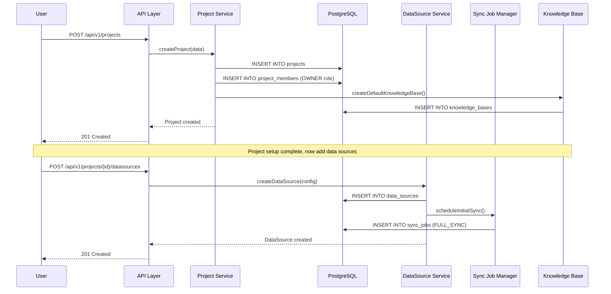
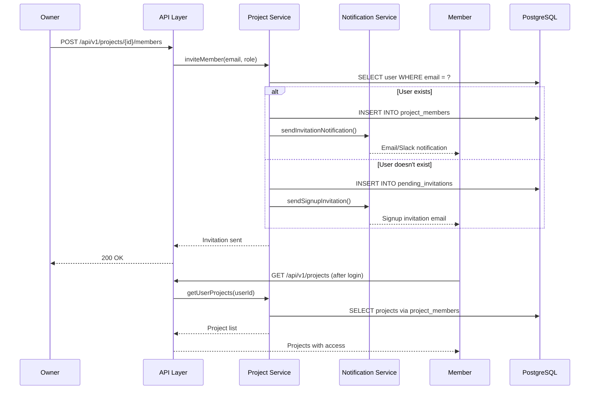
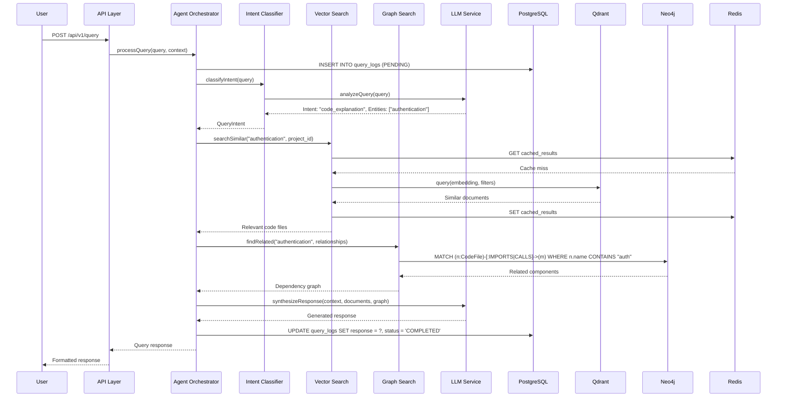
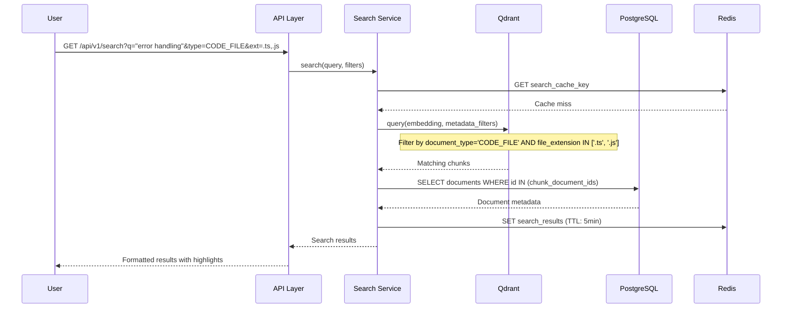
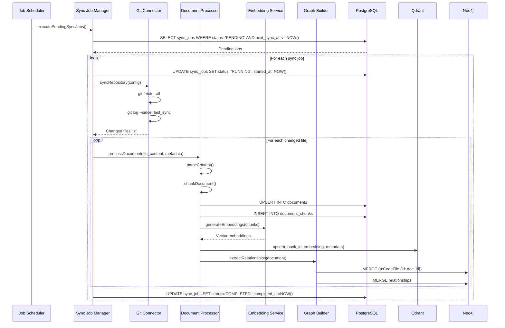
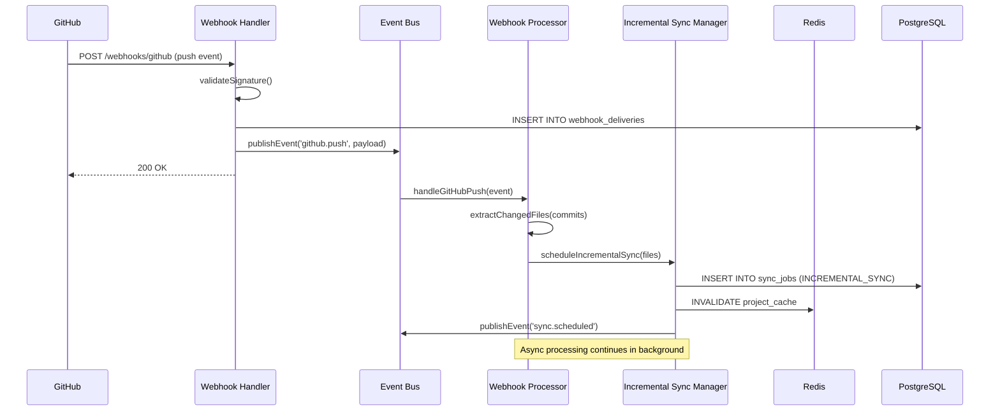
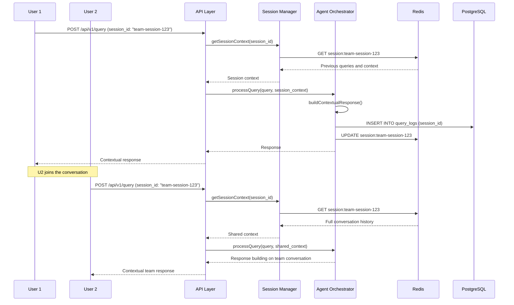
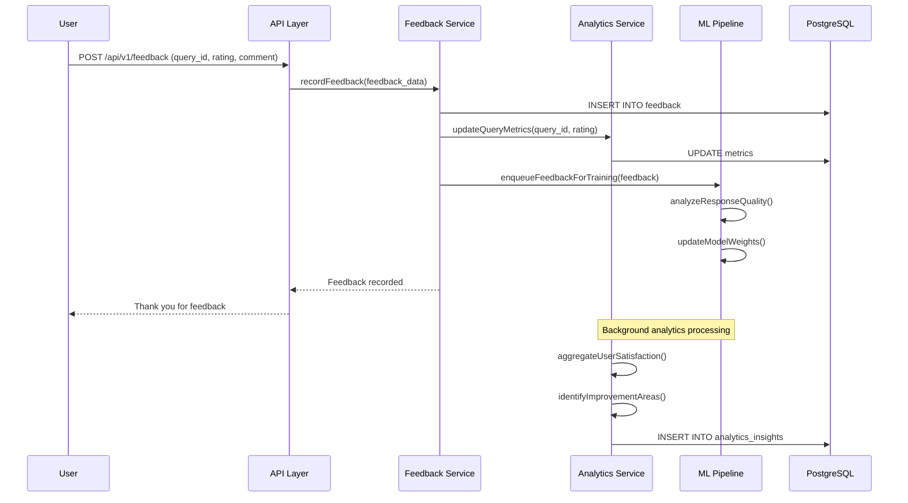
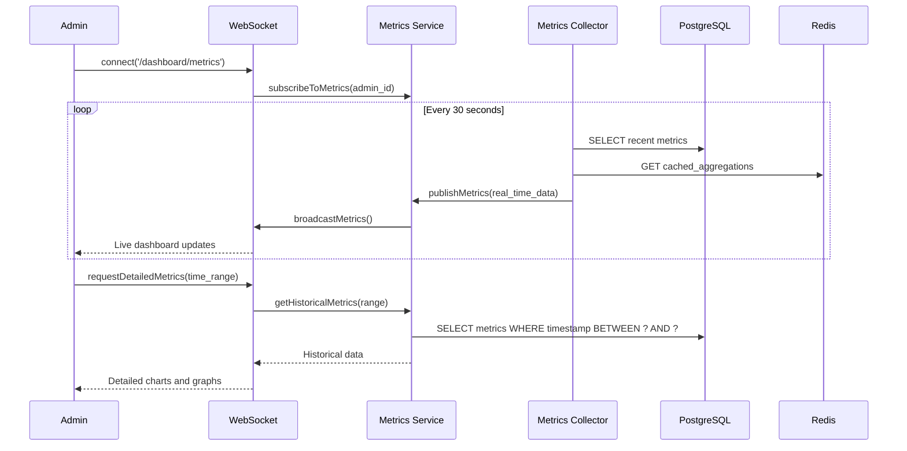
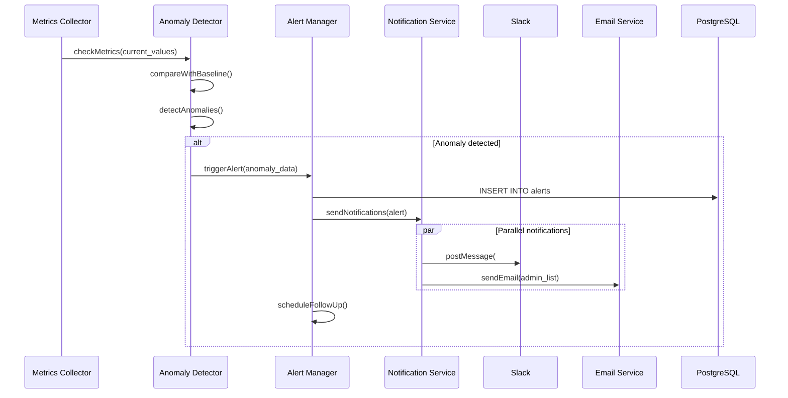

# User Interaction Scenarios

This document outlines the end-to-end data flow for various user interaction scenarios in Hikma, showing how data moves through the system from user action to response.

## 🎯 Scenario Categories

### 1. Project Onboarding Scenarios
### 2. Query & Search Scenarios  
### 3. Data Synchronization Scenarios
### 4. Collaboration Scenarios
### 5. Analytics & Monitoring Scenarios

---

## 1. Project Onboarding Scenarios

### Scenario 1.1: New Project Creation

**User Journey**: Developer creates a new project and connects data sources



**Data Flow Details:**

1. **Project Creation**:
   - User data validated and project record created
   - User automatically becomes project owner
   - Default knowledge base containers created
   - Project settings initialized with defaults

2. **Data Source Configuration**:
   - External system credentials validated
   - Connection tested and configuration stored
   - Initial sync job scheduled
   - Webhook endpoints configured (if applicable)

**Database Changes**:
```sql
-- Project creation
INSERT INTO projects (id, name, slug, status, settings) VALUES (...);
INSERT INTO project_members (project_id, user_id, role) VALUES (..., 'OWNER');
INSERT INTO knowledge_bases (project_id, name, description) VALUES (..., 'Main Codebase', ...);

-- Data source addition
INSERT INTO data_sources (project_id, name, type, config, status) VALUES (...);
INSERT INTO sync_jobs (project_id, data_source_id, type, status) VALUES (..., 'FULL_SYNC', 'PENDING');
```

### Scenario 1.2: Team Member Invitation

**User Journey**: Project owner invites team members with specific roles



---

## 2. Query & Search Scenarios

### Scenario 2.1: Natural Language Code Query

**User Journey**: Developer asks "How does authentication work in this codebase?"



**Data Flow Details:**

1. **Query Processing**:
   - Query logged with user context and project scope
   - Intent classification extracts key entities and determines processing pipeline
   - Multiple search strategies executed in parallel

2. **Knowledge Retrieval**:
   - Vector search finds semantically similar content
   - Graph traversal discovers related components
   - Cache layer reduces latency for repeated queries

3. **Response Generation**:
   - Context assembled from multiple sources
   - LLM generates coherent response
   - Response quality validated and logged

**Performance Optimizations**:
- Parallel execution of search operations
- Multi-level caching (Redis, application-level)
- Connection pooling for database operations
- Async processing for non-critical operations

### Scenario 2.2: Code Search with Filters

**User Journey**: Developer searches for "error handling" in specific file types



---

## 3. Data Synchronization Scenarios

### Scenario 3.1: Scheduled Repository Sync

**User Journey**: System performs scheduled sync of Git repository



**Error Handling**:
- Transactional processing with rollback on failures
- Partial sync recovery for large repositories
- Dead letter queue for failed document processing
- Exponential backoff for external API failures

### Scenario 3.2: Real-time Webhook Processing

**User Journey**: GitHub webhook triggers immediate content update



---

## 4. Collaboration Scenarios

### Scenario 4.1: Team Query with Context Sharing

**User Journey**: Team member asks question building on previous conversation



### Scenario 4.2: Feedback and Learning Loop

**User Journey**: User provides feedback on query response quality



---

## 5. Analytics & Monitoring Scenarios

### Scenario 5.1: Real-time Performance Dashboard

**User Journey**: Admin views system performance metrics



### Scenario 5.2: Automated Alert Processing

**User Journey**: System detects performance anomaly and sends alerts



---

## 🔧 Cross-Cutting Concerns

### Authentication & Authorization

All scenarios include authentication and authorization checks:

```typescript
// Middleware applied to all API endpoints
async function authMiddleware(request: FastifyRequest) {
  const token = extractToken(request.headers.authorization);
  const user = await validateToken(token);
  const project = await getProjectFromRequest(request);
  
  // Check user has access to project
  await checkProjectAccess(user.id, project.id);
  
  request.user = user;
  request.project = project;
}
```

### Error Handling

Consistent error handling across all scenarios:

```typescript
// Global error handler
async function errorHandler(error: Error, request: FastifyRequest, reply: FastifyReply) {
  // Log error with context
  logger.error('Request failed', {
    error: error.message,
    stack: error.stack,
    userId: request.user?.id,
    projectId: request.project?.id,
    requestId: request.id
  });
  
  // Update metrics
  await metricsService.incrementErrorCount(error.constructor.name);
  
  // Return appropriate response
  const statusCode = getStatusCodeFromError(error);
  reply.status(statusCode).send({
    error: error.message,
    requestId: request.id
  });
}
```

### Caching Strategy

Multi-level caching improves performance across scenarios:

```typescript
// Cache hierarchy
const cacheStrategy = {
  L1: 'Application Memory',    // Hot data, 1-5 minutes TTL
  L2: 'Redis',                // Warm data, 5-60 minutes TTL  
  L3: 'Database Query Cache', // Cold data, 1-24 hours TTL
};
```

### Monitoring & Observability

All scenarios include comprehensive monitoring:

- **Request Tracing**: Distributed tracing across all services
- **Performance Metrics**: Response times, throughput, error rates
- **Business Metrics**: User engagement, query success rates
- **Infrastructure Metrics**: Database performance, cache hit rates

---

These user interaction scenarios demonstrate how Hikma's architecture supports complex workflows while maintaining performance, reliability, and user experience quality.