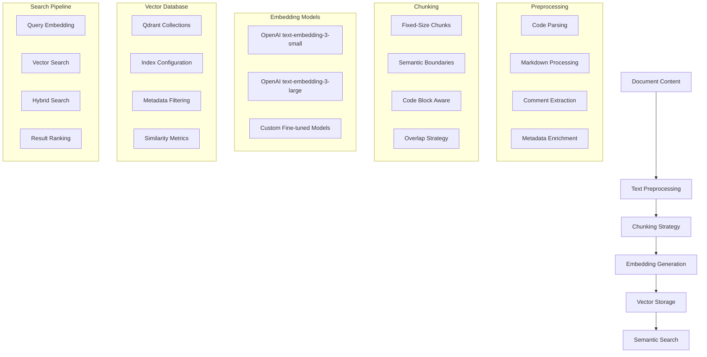

# Vector Embeddings

This document explains Hikma's vector embedding system, covering embedding generation, storage strategies, and semantic search implementation using Qdrant as the primary vector database.

## 🎯 Overview

Hikma uses vector embeddings to enable **semantic search** across codebases, allowing users to find relevant code, documentation, and issues using natural language queries rather than exact keyword matches.

## 🏗️ Architecture



## 📝 Document Processing Pipeline

### 1. Content Preprocessing

**Code-Aware Text Processing**:
```typescript
interface DocumentProcessor {
  async processDocument(document: Document): Promise<ProcessedDocument> {
    const content = await this.preprocessContent(document);
    const chunks = await this.chunkDocument(content, document.type);
    const enrichedChunks = await this.enrichWithMetadata(chunks, document);
    
    return {
      document,
      chunks: enrichedChunks,
      metadata: this.extractDocumentMetadata(document)
    };
  }

  private async preprocessContent(document: Document): Promise<string> {
    switch (document.type) {
      case 'CODE_FILE':
        return this.processCodeFile(document.content);
      case 'MARKDOWN':
        return this.processMarkdown(document.content);
      case 'PULL_REQUEST':
        return this.processPullRequest(document.content);
      case 'ISSUE':
        return this.processIssue(document.content);
      default:
        return this.processPlainText(document.content);
    }
  }
}
```

**Code File Processing**:
```typescript
class CodeFileProcessor {
  async processCodeFile(content: string, filePath: string): Promise<string> {
    const ast = await this.parseToAST(content, this.getLanguage(filePath));
    
    // Extract meaningful code segments
    const segments = [
      ...this.extractFunctions(ast),
      ...this.extractClasses(ast),
      ...this.extractInterfaces(ast),
      ...this.extractComments(ast),
      ...this.extractImports(ast)
    ];
    
    // Combine with context
    return segments.map(segment => {
      return `${segment.type}: ${segment.name}\n${segment.content}\n\nContext: ${segment.context}`;
    }).join('\n\n');
  }

  private extractFunctions(ast: AST): CodeSegment[] {
    return ast.functions.map(func => ({
      type: 'function',
      name: func.name,
      content: func.body,
      context: `File: ${func.filePath}, Line: ${func.startLine}`,
      metadata: {
        parameters: func.parameters,
        returnType: func.returnType,
        complexity: this.calculateComplexity(func)
      }
    }));
  }
}
```

### 2. Chunking Strategy

**Intelligent Document Chunking**:
```typescript
interface ChunkingStrategy {
  chunkSize: number;
  overlapSize: number;
  respectBoundaries: boolean;
}

class SemanticChunker {
  private strategies: Map<DocumentType, ChunkingStrategy> = new Map([
    ['CODE_FILE', { chunkSize: 1000, overlapSize: 200, respectBoundaries: true }],
    ['MARKDOWN', { chunkSize: 1500, overlapSize: 150, respectBoundaries: true }],
    ['PULL_REQUEST', { chunkSize: 2000, overlapSize: 100, respectBoundaries: false }],
    ['ISSUE', { chunkSize: 1200, overlapSize: 100, respectBoundaries: false }]
  ]);

  async chunkDocument(content: string, type: DocumentType): Promise<DocumentChunk[]> {
    const strategy = this.strategies.get(type) || this.getDefaultStrategy();
    
    if (strategy.respectBoundaries) {
      return this.semanticChunking(content, strategy);
    } else {
      return this.fixedSizeChunking(content, strategy);
    }
  }

  private async semanticChunking(content: string, strategy: ChunkingStrategy): Promise<DocumentChunk[]> {
    // Identify semantic boundaries (functions, classes, sections)
    const boundaries = await this.identifySemanticBoundaries(content);
    const chunks: DocumentChunk[] = [];
    
    let currentChunk = '';
    let chunkIndex = 0;
    
    for (const boundary of boundaries) {
      if (currentChunk.length + boundary.content.length > strategy.chunkSize) {
        if (currentChunk.length > 0) {
          chunks.push(this.createChunk(currentChunk, chunkIndex++, boundary.metadata));
          currentChunk = this.getOverlap(currentChunk, strategy.overlapSize);
        }
      }
      currentChunk += boundary.content + '\n';
    }
    
    if (currentChunk.length > 0) {
      chunks.push(this.createChunk(currentChunk, chunkIndex, {}));
    }
    
    return chunks;
  }
}
```

### 3. Embedding Generation

**Multi-Model Embedding Strategy**:
```typescript
interface EmbeddingService {
  generateEmbedding(text: string, model?: EmbeddingModel): Promise<number[]>;
  batchGenerateEmbeddings(texts: string[], model?: EmbeddingModel): Promise<number[][]>;
}

class OpenAIEmbeddingService implements EmbeddingService {
  private models = {
    'text-embedding-3-small': { dimensions: 1536, costPerToken: 0.00002 },
    'text-embedding-3-large': { dimensions: 3072, costPerToken: 0.00013 }
  };

  async generateEmbedding(text: string, model = 'text-embedding-3-small'): Promise<number[]> {
    // Preprocess text for optimal embedding
    const processedText = this.preprocessForEmbedding(text);
    
    const response = await this.openai.embeddings.create({
      model,
      input: processedText,
      encoding_format: 'float'
    });
    
    return response.data[0].embedding;
  }

  async batchGenerateEmbeddings(texts: string[], model = 'text-embedding-3-small'): Promise<number[][]> {
    // Process in batches to respect API limits
    const batchSize = 100;
    const results: number[][] = [];
    
    for (let i = 0; i < texts.length; i += batchSize) {
      const batch = texts.slice(i, i + batchSize);
      const processedBatch = batch.map(text => this.preprocessForEmbedding(text));
      
      const response = await this.openai.embeddings.create({
        model,
        input: processedBatch,
        encoding_format: 'float'
      });
      
      results.push(...response.data.map(item => item.embedding));
      
      // Rate limiting
      await this.delay(100);
    }
    
    return results;
  }

  private preprocessForEmbedding(text: string): string {
    return text
      .replace(/\s+/g, ' ')           // Normalize whitespace
      .replace(/[^\w\s\-_.]/g, '')    // Remove special characters
      .trim()
      .substring(0, 8000);            // Respect token limits
  }
}
```

## 🗄️ Vector Storage with Qdrant

### 1. Collection Configuration

**Qdrant Collection Setup**:
```typescript
interface QdrantCollectionConfig {
  name: string;
  vectorSize: number;
  distance: 'Cosine' | 'Euclidean' | 'Dot';
  indexConfig: {
    type: 'hnsw' | 'flat';
    m?: number;
    efConstruct?: number;
  };
}

class QdrantVectorStore {
  async createCollection(projectId: string, config: QdrantCollectionConfig): Promise<void> {
    const collectionName = `hikma_${projectId}`;
    
    await this.client.createCollection(collectionName, {
      vectors: {
        size: config.vectorSize,
        distance: config.distance,
        hnsw_config: {
          m: config.indexConfig.m || 16,
          ef_construct: config.indexConfig.efConstruct || 100,
          full_scan_threshold: 10000
        }
      },
      optimizers_config: {
        deleted_threshold: 0.2,
        vacuum_min_vector_number: 1000,
        default_segment_number: 0,
        max_segment_size: null,
        memmap_threshold: null,
        indexing_threshold: 20000,
        flush_interval_sec: 5,
        max_optimization_threads: 1
      }
    });
  }

  async upsertVectors(
    projectId: string, 
    vectors: VectorPoint[]
  ): Promise<void> {
    const collectionName = `hikma_${projectId}`;
    
    // Batch upsert for better performance
    const batchSize = 100;
    for (let i = 0; i < vectors.length; i += batchSize) {
      const batch = vectors.slice(i, i + batchSize);
      
      await this.client.upsert(collectionName, {
        wait: true,
        points: batch.map(vector => ({
          id: vector.id,
          vector: vector.embedding,
          payload: {
            document_id: vector.documentId,
            chunk_index: vector.chunkIndex,
            content: vector.content,
            document_type: vector.documentType,
            file_path: vector.filePath,
            created_at: vector.createdAt.toISOString(),
            ...vector.metadata
          }
        }))
      });
    }
  }
}
```

### 2. Metadata Schema

**Rich Metadata for Filtering**:
```typescript
interface VectorMetadata {
  // Document identification
  document_id: string;
  chunk_index: number;
  document_type: DocumentType;
  
  // Content metadata
  file_path?: string;
  file_extension?: string;
  language?: string;
  
  // Code-specific metadata
  function_name?: string;
  class_name?: string;
  complexity_score?: number;
  
  // Context metadata
  author?: string;
  created_at: string;
  updated_at: string;
  
  // Project metadata
  project_id: string;
  knowledge_base_id: string;
  data_source_id: string;
  
  // Quality metrics
  content_length: number;
  embedding_model: string;
  embedding_version: string;
}
```

### 3. Search Implementation

**Hybrid Search Strategy**:
```typescript
class HybridSearchService {
  async search(
    query: string,
    projectId: string,
    options: SearchOptions = {}
  ): Promise<SearchResult[]> {
    // Generate query embedding
    const queryEmbedding = await this.embeddingService.generateEmbedding(query);
    
    // Prepare search filters
    const filters = this.buildFilters(projectId, options);
    
    // Execute vector search
    const vectorResults = await this.vectorSearch(
      queryEmbedding,
      projectId,
      filters,
      options.limit || 20
    );
    
    // Execute keyword search if needed
    const keywordResults = options.includeKeywordSearch 
      ? await this.keywordSearch(query, projectId, filters)
      : [];
    
    // Combine and rank results
    return this.combineResults(vectorResults, keywordResults, options);
  }

  private async vectorSearch(
    queryEmbedding: number[],
    projectId: string,
    filters: QdrantFilter,
    limit: number
  ): Promise<VectorSearchResult[]> {
    const collectionName = `hikma_${projectId}`;
    
    const searchResult = await this.qdrant.search(collectionName, {
      vector: queryEmbedding,
      filter: filters,
      limit,
      with_payload: true,
      with_vector: false,
      score_threshold: 0.7 // Minimum similarity threshold
    });
    
    return searchResult.map(point => ({
      id: point.id as string,
      score: point.score,
      metadata: point.payload as VectorMetadata,
      content: point.payload?.content as string
    }));
  }

  private buildFilters(projectId: string, options: SearchOptions): QdrantFilter {
    const conditions: QdrantCondition[] = [
      { key: 'project_id', match: { value: projectId } }
    ];
    
    if (options.documentTypes?.length) {
      conditions.push({
        key: 'document_type',
        match: { any: options.documentTypes }
      });
    }
    
    if (options.fileExtensions?.length) {
      conditions.push({
        key: 'file_extension',
        match: { any: options.fileExtensions }
      });
    }
    
    if (options.dateRange) {
      conditions.push({
        key: 'created_at',
        range: {
          gte: options.dateRange.from.toISOString(),
          lte: options.dateRange.to.toISOString()
        }
      });
    }
    
    return { must: conditions };
  }
}
```

## 🔍 Search Optimization

### 1. Query Enhancement

**Query Preprocessing for Better Results**:
```typescript
class QueryEnhancer {
  async enhanceQuery(originalQuery: string, context: QueryContext): Promise<string> {
    // Extract technical terms and expand them
    const technicalTerms = await this.extractTechnicalTerms(originalQuery);
    const expandedTerms = await this.expandTechnicalTerms(technicalTerms);
    
    // Add context-specific keywords
    const contextKeywords = this.getContextKeywords(context);
    
    // Combine original query with enhancements
    return [
      originalQuery,
      ...expandedTerms,
      ...contextKeywords
    ].join(' ');
  }

  private async extractTechnicalTerms(query: string): Promise<string[]> {
    // Use NLP to identify technical terms
    const tokens = await this.nlpService.tokenize(query);
    return tokens.filter(token => 
      this.isTechnicalTerm(token) || 
      this.isCodeKeyword(token) ||
      this.isFrameworkName(token)
    );
  }

  private getContextKeywords(context: QueryContext): string[] {
    const keywords: string[] = [];
    
    // Add programming language context
    if (context.primaryLanguage) {
      keywords.push(context.primaryLanguage);
    }
    
    // Add framework context
    if (context.frameworks?.length) {
      keywords.push(...context.frameworks);
    }
    
    // Add recent activity context
    if (context.recentFiles?.length) {
      const fileTypes = context.recentFiles.map(f => path.extname(f));
      keywords.push(...new Set(fileTypes));
    }
    
    return keywords;
  }
}
```

### 2. Result Ranking

**Multi-Factor Ranking Algorithm**:
```typescript
class ResultRanker {
  rankResults(results: SearchResult[], query: string, context: QueryContext): SearchResult[] {
    return results
      .map(result => ({
        ...result,
        finalScore: this.calculateFinalScore(result, query, context)
      }))
      .sort((a, b) => b.finalScore - a.finalScore);
  }

  private calculateFinalScore(
    result: SearchResult, 
    query: string, 
    context: QueryContext
  ): number {
    const weights = {
      vectorSimilarity: 0.4,
      keywordMatch: 0.2,
      recency: 0.15,
      popularity: 0.1,
      contextRelevance: 0.15
    };
    
    const scores = {
      vectorSimilarity: result.score,
      keywordMatch: this.calculateKeywordMatch(result.content, query),
      recency: this.calculateRecencyScore(result.metadata.created_at),
      popularity: this.calculatePopularityScore(result.metadata.document_id),
      contextRelevance: this.calculateContextRelevance(result, context)
    };
    
    return Object.entries(weights).reduce((total, [factor, weight]) => {
      return total + (scores[factor as keyof typeof scores] * weight);
    }, 0);
  }

  private calculateKeywordMatch(content: string, query: string): number {
    const queryTerms = query.toLowerCase().split(/\s+/);
    const contentLower = content.toLowerCase();
    
    const matches = queryTerms.filter(term => contentLower.includes(term));
    return matches.length / queryTerms.length;
  }

  private calculateRecencyScore(createdAt: string): number {
    const age = Date.now() - new Date(createdAt).getTime();
    const daysSinceCreation = age / (1000 * 60 * 60 * 24);
    
    // Exponential decay: newer content gets higher scores
    return Math.exp(-daysSinceCreation / 30); // 30-day half-life
  }
}
```

## 📊 Performance Monitoring

### 1. Embedding Quality Metrics

**Tracking Embedding Performance**:
```typescript
class EmbeddingQualityMonitor {
  async trackEmbeddingQuality(
    query: string,
    results: SearchResult[],
    userFeedback?: UserFeedback
  ): Promise<void> {
    const metrics = {
      query_id: generateId(),
      query_text: query,
      result_count: results.length,
      avg_similarity_score: this.calculateAverageScore(results),
      top_score: results[0]?.score || 0,
      score_distribution: this.calculateScoreDistribution(results),
      user_satisfaction: userFeedback?.rating,
      timestamp: new Date()
    };
    
    await this.metricsService.recordEmbeddingMetrics(metrics);
  }

  private calculateScoreDistribution(results: SearchResult[]): ScoreDistribution {
    const scores = results.map(r => r.score);
    return {
      min: Math.min(...scores),
      max: Math.max(...scores),
      median: this.calculateMedian(scores),
      std_dev: this.calculateStandardDeviation(scores)
    };
  }
}
```

### 2. Search Performance Optimization

**Caching and Performance Tuning**:
```typescript
class SearchPerformanceOptimizer {
  private queryCache = new LRUCache<string, SearchResult[]>({
    max: 1000,
    ttl: 1000 * 60 * 5 // 5 minutes
  });

  async optimizedSearch(
    query: string,
    projectId: string,
    options: SearchOptions
  ): Promise<SearchResult[]> {
    const cacheKey = this.generateCacheKey(query, projectId, options);
    
    // Check cache first
    const cached = this.queryCache.get(cacheKey);
    if (cached) {
      await this.metricsService.incrementCacheHit('vector_search');
      return cached;
    }
    
    // Execute search with performance monitoring
    const startTime = Date.now();
    const results = await this.hybridSearch.search(query, projectId, options);
    const duration = Date.now() - startTime;
    
    // Cache results
    this.queryCache.set(cacheKey, results);
    
    // Record performance metrics
    await this.metricsService.recordSearchPerformance({
      query_length: query.length,
      result_count: results.length,
      duration_ms: duration,
      cache_hit: false,
      project_id: projectId
    });
    
    return results;
  }
}
```

## 🔧 Configuration & Tuning

### 1. Model Selection Strategy

**Dynamic Model Selection**:
```typescript
interface ModelSelectionStrategy {
  selectEmbeddingModel(context: EmbeddingContext): EmbeddingModel;
  shouldUseCustomModel(projectId: string): Promise<boolean>;
}

class AdaptiveModelSelector implements ModelSelectionStrategy {
  selectEmbeddingModel(context: EmbeddingContext): EmbeddingModel {
    // For code-heavy content, use larger model for better accuracy
    if (context.documentType === 'CODE_FILE' && context.contentLength > 1000) {
      return 'text-embedding-3-large';
    }
    
    // For documentation and comments, smaller model is sufficient
    if (['MARKDOWN', 'COMMENT'].includes(context.documentType)) {
      return 'text-embedding-3-small';
    }
    
    // Default to balanced model
    return 'text-embedding-3-small';
  }

  async shouldUseCustomModel(projectId: string): Promise<boolean> {
    const projectStats = await this.getProjectStats(projectId);
    
    // Use custom model for large, specialized codebases
    return projectStats.documentCount > 10000 && 
           projectStats.uniqueLanguages.length <= 3;
  }
}
```

### 2. Index Optimization

**Qdrant Index Tuning**:
```typescript
class QdrantIndexOptimizer {
  async optimizeCollection(projectId: string): Promise<void> {
    const collectionName = `hikma_${projectId}`;
    const stats = await this.qdrant.getCollectionInfo(collectionName);
    
    // Adjust HNSW parameters based on collection size
    const optimizedConfig = this.calculateOptimalConfig(stats);
    
    await this.qdrant.updateCollection(collectionName, {
      hnsw_config: optimizedConfig,
      optimizer_config: {
        indexing_threshold: Math.max(1000, stats.vectors_count * 0.1)
      }
    });
  }

  private calculateOptimalConfig(stats: CollectionStats): HNSWConfig {
    const vectorCount = stats.vectors_count;
    
    if (vectorCount < 10000) {
      return { m: 16, ef_construct: 100 };
    } else if (vectorCount < 100000) {
      return { m: 32, ef_construct: 200 };
    } else {
      return { m: 48, ef_construct: 300 };
    }
  }
}
```

---

This vector embedding system provides Hikma with powerful semantic search capabilities while maintaining performance and accuracy across diverse code intelligence use cases.